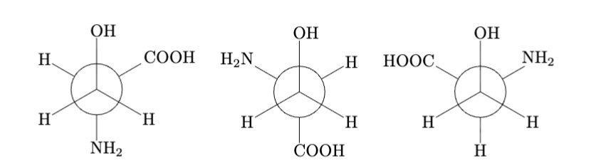
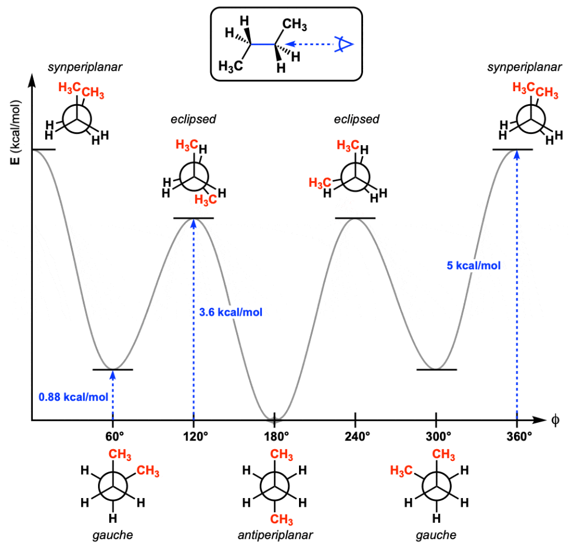
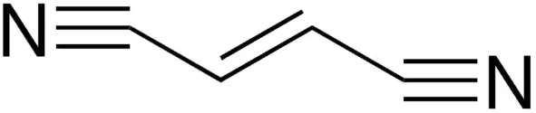
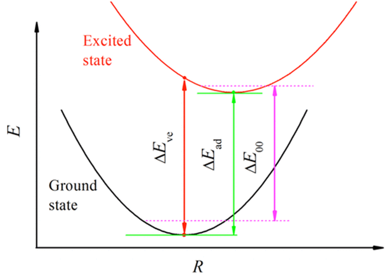

# Tutorial 1 : H₂ Binding, Convergence, and Relaxation

## 📖 Learning objectives:
- FHI-aims basic
- submitting jobs on Trace or Arjuna.
- numerical convergence & scaling
- structure optimization.

> **Notation used**
> - Distances are in Å
> - Activate your virtual env if the python script needs ase. If you don't have one, go [create one](../../HPC%20Onboard/virtual_env) !

---
##  FHI-aims basic

**FHI-aims** is an all-electron, DFT-based electronic structure code designed for:
- Molecules and periodic systems
- High-accuracy total energy and force calculations
- Materials simulations including structure relaxation, molecular dynamics, and property evaluation

FHI-aims uses numeric atom-centered orbitals and supports a wide range of functionals, dispersion corrections, and parallel execution on HPC clusters.
For detailed settings, please check [FHI-aims Manual](chrome-extension://efaidnbmnnnibpcajpcglclefindmkaj/https://fhi-aims.org/uploads/documents/FHI-aims.221103_1.pdf)


### 📁 Required Files in a FHI-aims Calculation

- `geometry.in`: Defines the atomic structure of the system.
- `control.in`: Specifies the calculation settings, must include species orbit definitions appended at the end (copied from species_defaults/)
- `submit.sh`: A SLURM batch script to run FHI-aims on HPC.

---

## EX1: H2 binding energy evaluation

### **Follow the steps**

- **Generate `control.in` Files by `write_control.py` script:**
    > Before running `write_control.py`, please make sure the `BASE_SPECIES_PATH` in the script is correct path of FHI-aims species directory.
    > - BASE_SPECIES_PATH on Arjuna: /home/27735A_group/shared/species_defaults/defaults_2020

    ```bash
    python /home/27735A_group/shared/example/write_control.py \
    --elements H --species_default light
    ```
    Run ``python /home/27735A_group/shared/example/write_control.py --help`` for full flag descriptions.

    The `control.in` will looks like:
    ```bash
    xc pw-lda                # Exchange-correlation: LDA
    spin none                # Non-spin-polarized
    relativistic none        # No relativistic effects
    charge 0                 # Neutral system
    hessian_to_restart_geometry .false.  # Do not reuse Hessian for geometry restart
    KS_method parallel       # Being able to use mpi for parallel running.
    ```


- **Generate `geometry.in` Files at Different H–H Distances**

- **Build `geometry.in` for H₂**
    In `geometry.in` file, each atom is given by :

    ```bash
    atom x y z Element
    ```
    * Put the first H at the origin: `(0.0 0.0 0.0)`
    * Put the second H on the z-axis: `(0.0 0.0 d)` where `d` = bond length (Å).

    Create H₂ geometries with bond lengths from 0.5 Å to 1.0 Å at a step 0.1 Å:

    You can optionally **visualize the structures** using:

    * **[Jmol](https://jmol.sourceforge.net/)** for orbital inspection
    * **[OVITO](https://www.ovito.org/)** for 3D structural visualization

- **Copy your submit.sh file to your current path**
  copy the submit.sh file by :
    ```bash
    cp /home/27735A_group/shared/example/submit.sh .
    ```
---

- **Run FHI-aims Calculations**
    Before submitting jobs, please make sure you have activated your `aims_env`.

    The help script `distance_generator.py` can create folders for each distance, also help paste `control.in` and `submit.sh` in each folder. Then you can enter each folder, submit the job by :

    ```bash
    sbatch submit.sh
    ```

    Submit each folder to your cluster, You’ll know the run is finished when:

    * You see `Have a nice day.` at the end of `aims.out`
    * Or check status on HPC with:

      ```bash
      squeue -u <your_username>
      ```

---

- **Extract Energies & Plot Dissociation Curve**

    After runs finish, run this command under the calc folder that contains `aims.out`:

    ```bash
    grep '| Total energy of the DFT / Hartree-Fock s.c.f. calculation' aims.out > energies.txt
    ```
    Copy it as one line!

---


### **Assignment 1**: Plotting the Dissociation Curve (20 Points)

* (10 Points) Plot the **dissociation curve of H₂** .
* Visualize the structure at, attach the plots in your doc:
  * The **energy minimum**
  * Two other **interatomic distances** of your choosing
* From the plot, extract :
  * **Bond energy**
  * **Equilibrium bond length(estimate)**

* (10 Points) (Come back to it when you finish the EX3) Relax the structure and get the bond length.
  * Compare your results to **literature values** and cite your sources.
  * Draw conclusions from the comparison.


Now, you have successdully set up a simple DFT workflow to evaluate the **H₂ binding energy** by generating a **dissociation curve** !

---

## EX2:  Numerical convergence & scaling

In this exercise, we will compare **basis tiers 1–3** and species defaults **light / intermediate / tight** to analyze accuracy vs cost.
### **Follow the steps**

- The basis functions are classified in “tiers” (i.e., levels of importance). Not all basis functions are enabled by default. Rather, higher tiers than the desired one should be  commented out using the “ # ” symbol. 
  - You can select the basis tiers by leaving the desired one and lower tiers uncomment in `control.in` files.
- Species defaults control the numerical integration grids, cutoff radii, and other internal accuracy parameters. light is the fastest, tight is the most accurate.
  - You can change the species defaults by changing the param `--species_default` when preparing `control.in` files using `write_control.py`

To evaluate the cost, grep the time of each runs:
  ```bash
  grep '| Total time                                  :' aims.out > times.txt
  ```
  Copy it as one line !
  You will get 2 kinds of time (max(cpu_time) and wall_clock(cpu1)), use wall_clock for evaluation.

---

### **Assignment 2**: Numerical Convergence and Scaling Plots (20 Points)

* Plot the **dissociation curve of H₂** using different (10 Points) (only for the optimal H2 bond length, for instance, 0.8 Å):
  * **Basis set tiers**: tier 1, tier 2, tier 3
  * **Species defaults levels**: light, intermediate, tight (in FHI-aims)

* Discuss (10 Points) :
  * How basis set and species defaults choices affect your results
  * The **CPU time** required to compute one point (i.e., one interatomic distance) under each setting
  * The trade-off between **accuracy vs. computational cost**
* State which settings you consider **optimal** and justify your choice.

---

## EX3: Structure optimization/relaxation

### **Follow the steps**

- Pick the run with the lowest-energy, Put the `geometry.in`,`control.in` and `submit.sh` in the `relaxation` folder. Then add this command to the `control.in` file for non-periodic relaxation: 
  ```text
  relax_geometry bfgs 1e-2
  ```
- Compare the difference between the `control.in` for single point energy and relaxtion.

- **Make a “relaxation movie”** in **OVITO** from FHI-aims output by excuting `extract_traj_frame.py` help script, then drag the output `.xyz` file in **OVITO**.

- **Check Final H–H Distance.**
  After relaxation, check final structure `geometry.in.next_step` use visulization tool or execute this python script:
    ```bash
    python get_distance.py
    ```
---


## Section 2 – Simple Organic Molecules

### **Learning Objectives**
- Visualising,comparing and Stability-ranking of conformers. 
- Vertical vs adiabatic IP & EA, and how to compute them. 

---

## EX1: Conformers

### **What are conformers?**

* Molecules with the **same formula** and **same bonds**,
* But **different 3D orientations** due to **rotation around single bonds**.
* Not mirror images.
👉 Conformers = same molecule, different shapes from bond rotation.

---

### **How do we describe conformers?**


**Figure 1:** serine



**Figure 2:** Newmann Projections of serine conformers.

* Use a **dihedral angle**: the rotation angle between two groups across a bond.
* Example: in **serine**, we can look down a C–C bond and measure how the **–COOH group** rotates relative to the **–OH group** at 0°,as shown in the above Newman Projections.
* Different dihedral angles = different conformers.
---

### **Energy and dihedral angles**

* As you rotate a molecule, the **energy changes**.
* Here is an Example plotting energy vs. dihedral angle gives the **conformational energy profile** of  **Butane** :
* Multiple **local minima** (stable conformers).
* One **global minimum** (most stable).



**Figure 3:** Energy vs. dihedral angle of butane.


* Conformers can get **trapped in local minima**, so computational methods may not always find the **global minimum**. For molecules like serine, the global minimum is not obvious — it must be **calculated and compared**.

---

### **Follow the steps**
- Make a folder for each [serine conformers](https://aminoacidsguide.com/Ser.html) (named by different dihedral angle. `60.in`,`180.in`,`300.in`) and rename each `.in` files to `geometry.in`. Try to prepare `control.in` by reading from `geometry.in` this time by `write_control.py`:

  ```bash
  python /home/27735A_group/shared/example/write_control.py \
  --input_geometry --species_default light 
  ```
  then add this line for non-periodic relaxation:
  ```text
  relax_geometry bfgs 1e-2
  ```
- Then copy `submit.sh` to each folders, submit the jobs and grep the energy after DFT calculations finished, same as Section 1.


### **Assignment 3**: Relative Energies of Serine Conformers (20 Points)


* (10 Points) Compute **ΔE = E – E<sub>min</sub>**. Usually we want to convert eV (in DFT results) to KJ/mol by timing the factor 96.485. Plot ΔE vs dihedral angle → identify global minimum among local minimums.
* (10 Points) Compare the **relative energies of conformers** after relaxation you obtained with:
  * Local Density Approximation (**LDA**)
  * **[DFT with hybrid functional B3LYP](https://www.researchgate.net/publication/231638970_Conformational_behavior_of_serine_An_experimental_matrix-isolation_FT-IR_and_theoretical_DFTB3LYP6-31G_study?utm_source=chatgpt.com)**. (click to access to papers)
  * **[CCSD(T)](https://pubmed.ncbi.nlm.nih.gov/27294314/)** results.
* Draw conclusions from the comparison.
---


## EX2:  Compute IP & EA of fumaronitrile.


Here is the structure of **fumaronitrile**: 



**Figure 4: fumaronitrile**

###  **IP & EA**
- IP(Ionization Potential):  Energy required to remove 1 e⁻, E<sub>N-1</sub> − E<sub>N</sub>

- EA(Electron Affinity) : Energy released / required to add 1 e⁻, E<sub>N</sub> − E<sub>N+1</sub>


### **Vertical & Adiabatic**
- Vertical (V): Energy difference between the excited state and the ground state while the geometry is held constant.
- Adiabatic (A): Energy difference between the excited state after post-excitation relaxation and the ground state. 




[**Figure5**](https://pubs.acs.org/doi/10.1021/jp501974p): Vertical (∆E_ve) versus adiabatic (∆E_ad) energies. 


### **Follow the steps**

- **Relax neutral molecule, get E(0) and prepare geometry.in**

    Rename `fumaronitrile.in` to `geometry.in`, try to relax it, you already know how to do that! Start from the relaxed neutral structure for the following calculation, add the line `initial_moment 1` to the beginning of the `geometry.in.next_step` file, then copy it under the "vertical/adiabatic" dir by(for example) :
    ```bash
    cp geometry.in.next_step ./IP/adiabatic/geometry.in
    ```
- **Adiabatic & Vertical (IP)**

    Create `control.in` file. Key edits in `control.in` (adiabatic):

    ```
    spin             collinear
    charge           +1.
    fixed_spin_moment 1
    relax_geometry bfgs 1e-2
    ```
    Delete `relax_geometry` for **vertical** calculation.

- **EA is analogous (charge –1).**

- **Extract & compute**

    Compute each single point energy of each runs, grep E(+1) and E(–1), compute ΔE_ip and ΔE_ea.
    ```
    ΔE_ip  = E(+1) – E(0)
    ΔE_ea  = E(0) – E(–1)
    ```
---

### **Assignment 4**: Ionization Potential (IP) and Electron Affinity (EA) of Fumaronitrile (20 Points)

* Compare the results of **IP and EA of fumaronitrile** you obtained using LDA with the  **[Experimental values](https://webbook.nist.gov/cgi/cbook.cgi?ID=C764421&Mask=107F&utm_source=chatgpt.com)** and **[CCSD(T) reference values](https://pubs.acs.org/doi/10.1021/acs.jctc.5b00875)**
  * **Note**: all computed values reported in these papers are **vertical values**.
  * Draw conclusions from the comparison.


  
---

### **Assignment 5**: Energy Scales in DFT (20 points)

You need to compare **three different types of energies** that appear in electronic structure calculations:

- **Total energy (DFT ground-state energy)**.
- **Electronic excitations (IPs and EAs)**.
- **Relative energies of conformers**.
Then you discuss:
* Is the **total energy itself meaningful**?
* What do these different energy scales imply about **how accurate DFT (or any electronic structure method) must be**?

