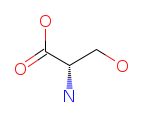
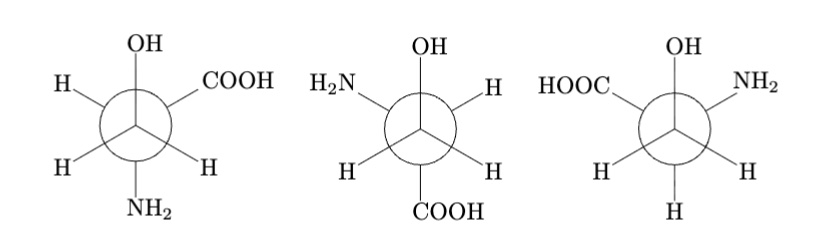
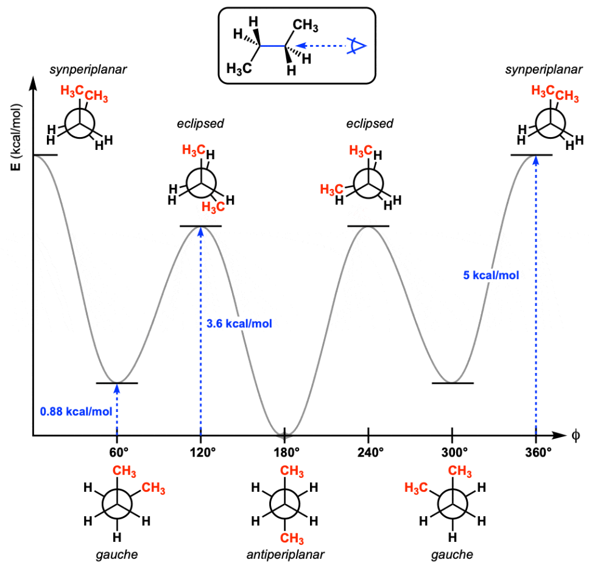
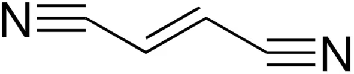
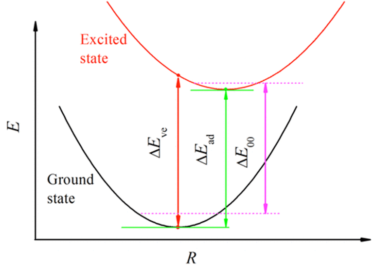

# Tutorial 1 – Simple Molecules: H₂ Binding, Convergence, and Conformers

### 📘 Introduction

First-principles (DFT) calculations turn atomic structures into energies — and comparing those energies is how bond strengths, stable geometries, and molecular properties are predicted. This first tutorial builds that workflow from the ground up on small molecules, where every calculation runs in seconds and every result can be checked against your chemical intuition.

In this tutorial, we will explore:

* **FHI-aims basics** — the input files, running on the HPC cluster, and reading the output
* **The H₂ dissociation curve** — total energies vs. geometry, and bond energies as energy *differences*
* **Numerical convergence** — basis tiers and species defaults, accuracy vs. cost
* **Structure optimization** — letting the code find minimum-energy geometries
* **Conformers and ionization** — relative energies of serine conformers, and the IP/EA of fumaronitrile

---

### 🎯 Learning Objectives

By the end of this tutorial, you will be able to:

* Set up and submit FHI-aims calculations on TRACE or MSE-HPC and recognize a successfully finished run
* Construct `geometry.in`/`control.in` input pairs by hand and with the helper scripts
* Perform convergence tests over basis tiers and species defaults and justify a choice of settings
* Run structure relaxations and extract optimized geometries
* Compute physically meaningful energy *differences* — bond energies, conformer orderings, and vertical/adiabatic IPs and EAs — and compare them with literature values

---

> **Please Note**
> - Distances are in Å
> - Activate your virtual env if the python script needs ase. If you don't have one, go [create one](../../HPC%20Onboard/virtual_env/)
> - Please find `submit.sh` and `write_control.py` in the `utils/trace` or `utils/mse-hpc` folder.
> - Please find any other useful python scripts under `Tutorial_1` and its subfolders.
> - The helper scripts may print a `FutureWarning` about ASE's aims file format — it is harmless; ignore it.
> - If a job dies instantly complaining about missing keywords in `control.in`, your `write_control.py` step probably failed earlier (usually because `ase_env` was not active) while a later edit still created a stub file — delete `control.in`, activate the environment, and regenerate.

---
##  FHI-aims basic

**FHI-aims** is an all-electron, DFT-based electronic structure code designed for:
- Molecules and periodic systems
- High-accuracy total energy and force calculations
- Materials simulations including structure relaxation, molecular dynamics, and property evaluation

FHI-aims uses numeric atom-centered orbitals and supports a wide range of functionals, dispersion corrections, and parallel execution on HPC clusters.
For detailed settings, please check [FHI-aims Manual](https://fhi-aims.org/uploads/documents/FHI-aims.221103_1.pdf)


### 📁 Required Files in a FHI-aims Calculation

- `geometry.in`: Defines the atomic structure of the system.
- `control.in`: Specifies the calculation settings (xc functional, spin, etc.), must include species basis-set definitions appended at the end (copied from `species_defaults/` in your FHI-aims installation, organized by accuracy level: `light`, `intermediate`, `tight`)
- `submit.sh`: A SLURM batch script to run FHI-aims on HPC.

---

## EX1: H₂ binding energy evaluation

### **Follow the steps**

- **Generate `control.in` Files by `write_control.py` script:**
 
    ```bash
    python ~/aims_utils/write_control.py --elements H --species_default light
    ```
    Run ``python ~/aims_utils/write_control.py --help`` for full flag descriptions.

    The generated `control.in` starts with a block like this (comments added here for explanation — the generated file itself is bare):
    ```text
    xc pw-lda                # Exchange-correlation: LDA
    spin none                # Non-spin-polarized
    relativistic none        # No relativistic effects
    charge 0                 # Neutral system
    hessian_to_restart_geometry .false.  # Do not reuse Hessian for geometry restart
    KS_method parallel       # Being able to use mpi for parallel running.
    ```


- **Generate `geometry.in` Files at Different H–H Distances**

- **Build `geometry.in` for H₂**
    In the `geometry.in` file, each atom is given by:

    ```text
    atom x y z Element
    ```
    * Put the first H at the origin: `(0.0 0.0 0.0)`
    * Put the second H on the z-axis: `(0.0 0.0 d)` where `d` = bond length (Å).

    Create H₂ geometries with bond lengths from 0.5 Å to 1.0 Å at a step 0.1 Å, plus one wide separation (6.0 Å) that serves as the dissociation-limit reference for the bond energy:

    You can optionally **visualize the structures** using:

    * **[Jmol](https://jmol.sourceforge.net/)** for orbital inspection
    * **[OVITO](https://www.ovito.org/)** for 3D structural visualization

- **Copy your submit.sh file to your current path**

- **Run FHI-aims Calculations**
    `submit.sh` loads the FHI-aims runtime environment automatically inside the job, so you don't need to load any modules or environments before submitting.

    The help script `distance_generator.py` can create folders for each distance, also help paste `control.in` and `submit.sh` in each folder. Then you can enter each folder, submit the job by :

    ```bash
    sbatch ~/aims_utils/submit.sh
    ```

    > **Tip:** If your job runs out of time, you can edit `~/aims_utils/submit.sh` and increase the wall time limit (e.g. change `#SBATCH -t 1:00:00` to a longer duration).

    Submit each folder to your cluster. You'll know the run is finished when:

    * You see `Have a nice day.` at the end of `aims.out`
    * Or check status on HPC with:

      ```bash
      squeue -u <your_username>
      ```

---

- **Extract Energies & Plot Dissociation Curve**

    After runs finish, run this command under the calc folder that contains `aims.out`:

    ```bash
    grep '| Total energy of the DFT / Hartree-Fock s.c.f. calculation' aims.out > energies.txt
    ```
    Copy it as one line!

---


### **Assignment 1**: Plotting the Dissociation Curve (20 Points)

* (10 Points) Plot the **dissociation curve of H₂**.
* Visualize the structure and attach the plots in your doc at:
  * The **energy minimum**
  * Two other **interatomic distances** of your choosing
* From the plot, extract:
  * **Bond energy** (difference between the curve minimum and the 6.0 Å dissociation reference)
  * **Equilibrium bond length (estimate)**

* (10 Points) (Come back to it when you finish the EX3) Relax the structure and get the bond length.
  * Compare your results to **literature values** and cite your sources.
  * Draw conclusions from the comparison.


Now, you have successfully set up a simple DFT workflow to evaluate the **H₂ binding energy** by generating a **dissociation curve** !

---

## EX2:  Numerical convergence & scaling

In this exercise, we will compare **basis tiers 1–3** and species defaults **light / intermediate / tight** to analyze accuracy vs cost.
### **Follow the steps**

- The basis functions are classified in “tiers” (i.e., levels of importance). Not all basis functions are enabled by default. Rather, higher tiers than the desired one should be commented out using the “#” symbol.
  - You can select the basis tiers by leaving the desired one and lower tiers uncommented in `control.in` files. **Careful:** the `intermediate` and `tight` species files ship with some higher-tier lines *already enabled* (tight: all of tier 2; intermediate: part of it) — a clean tier comparison means commenting out as well as uncommenting, until exactly the tiers you want are active. (Lines starting `for_aux` are not basis functions — leave them alone.)
- Species defaults control the numerical integration grids, cutoff radii, and other internal accuracy parameters. `light` is the fastest, `tight` is the most accurate.
  - You can change the species defaults by changing the param `--species_default` when preparing `control.in` files using `write_control.py`

To evaluate the cost, grep the time of each run:
  ```bash
  grep '| Total time                                  :' aims.out > times.txt
  ```
  Copy it as one line!
  You will get 2 kinds of time (`max(cpu_time)` and `wall_clock(cpu1)`); use `wall_clock` for evaluation.

---

### **Assignment 2**: Numerical Convergence and Scaling Plots (20 Points)

* (10 Points) Plot the **energy of H₂** using different settings (only for the optimal H₂ bond length, for instance, 0.8 Å):
  * **Basis set tiers**: tier 1, tier 2, tier 3
  * **Species defaults levels**: light, intermediate, tight (in FHI-aims)

* (10 Points) Discuss:
  * How basis set and species defaults choices affect your results
  * The **CPU time** required to compute one point (i.e., one interatomic distance) under each setting
  * The trade-off between **accuracy vs. computational cost**
* State which settings you consider **optimal** and justify your choice.

---

## EX3: Structure optimization/relaxation

### **Follow the steps**

- Pick the run with the lowest energy, and put the `geometry.in`, `control.in` and `submit.sh` in the `relaxation` folder. Then add this command to the `control.in` file for non-periodic relaxation:
  ```text
  relax_geometry bfgs 1e-2
  ```
- Compare the difference between the `control.in` for single point energy and relaxation. The key difference is the `relax_geometry` keyword: without it FHI-aims computes the energy at the given geometry (single point); with it, FHI-aims iteratively moves atoms to minimize forces until convergence.

- **Make a “relaxation movie”** in **OVITO** from FHI-aims output by executing the `extract_traj_frame.py` help script, then drag the output `.xyz` file into **OVITO**.

- **Check Final H–H Distance.**
  After relaxation, check the final structure `geometry.in.next_step` using a visualization tool, or execute this python script:
    ```bash
    python get_distance.py
    ```
---


## Section 2 – Simple Organic Molecules

### **Learning Objectives**
- Visualising, comparing, and stability-ranking conformers.
- Vertical vs adiabatic IP & EA, and how to compute them.

---

## EX1: Conformers

### **What are conformers?**

* Molecules with the **same formula** and **same bonds**,
* But **different 3D orientations** due to **rotation around single bonds**.
* Not mirror images.

👉 Conformers = same molecule, different shapes from bond rotation.

---

### **How do we describe conformers?**



**Figure 1:** serine



**Figure 2:** Newman projections of serine conformers.

* Use a **dihedral angle**: the rotation angle between two groups across a bond.
* Example: in **serine**, we can look down a C–C bond and measure how the **–COOH group** rotates relative to the **–OH group** at 0°, as shown in the Newman projections above.
* Different dihedral angles = different conformers.

---

### **Energy and dihedral angles**

* As you rotate a molecule, the **energy changes**.
* Here is an Example plotting energy vs. dihedral angle gives the **conformational energy profile** of  **Butane** :
* Multiple **local minima** (stable conformers).
* One **global minimum** (most stable).



**Figure 3:** Energy vs. dihedral angle of butane.


* Conformers can get **trapped in local minima**, so computational methods may not always find the **global minimum**. For molecules like serine, the global minimum is not obvious — it must be **calculated and compared**.

---

### **Follow the steps**
- Make a folder for each [serine conformer](https://aminoacidsguide.com/Ser.html) (named by dihedral angle: `60.in`, `180.in`, `300.in`) and rename each `.in` file to `geometry.in`. Try to prepare `control.in` by reading from `geometry.in` this time with `write_control.py`:

  ```bash
  python ~/aims_utils/write_control.py --input_geometry --species_default light 
  ```
  then add this line for non-periodic relaxation:
  ```text
  relax_geometry bfgs 1e-2
  ```
- Then copy `submit.sh` to each folder, submit the jobs, and grep the energy after the DFT calculations finish, same as in Section 1.


### **Assignment 3**: Relative Energies of Serine Conformers (20 Points)


* (10 Points) Compute **ΔE = E – E<sub>min</sub>**. Usually we want to convert eV (in DFT results) to kJ/mol by multiplying by the factor 96.485 (1 eV = 96.485 kJ/mol). Plot ΔE vs dihedral angle → identify global minimum among local minima.
* (10 Points) Compare the **relative energies of conformers** after relaxation you obtained with:
  * Local Density Approximation (**LDA**)
  * **[DFT with hybrid functional B3LYP](https://www.researchgate.net/publication/231638970_Conformational_behavior_of_serine_An_experimental_matrix-isolation_FT-IR_and_theoretical_DFTB3LYP6-31G_study)** (click to access the paper)
  * **[CCSD(T)](https://pubmed.ncbi.nlm.nih.gov/27294314/)** results.
* Draw conclusions from the comparison.

---


## EX2:  Compute IP & EA of fumaronitrile.


Here is the structure of **fumaronitrile**: 



**Figure 4: fumaronitrile**

###  **IP & EA**
- IP (Ionization Potential): Energy required to remove 1 e⁻, E<sub>N-1</sub> − E<sub>N</sub>

- EA (Electron Affinity): Energy released / required to add 1 e⁻, E<sub>N</sub> − E<sub>N+1</sub>


### **Vertical & Adiabatic**
- Vertical (V): Energy difference computed at the **neutral ground-state geometry** — the ionized species is **not** relaxed. This corresponds to the instantaneous ionization/attachment process (Franck–Condon principle).
- Adiabatic (A): Energy difference where the ionized species is **relaxed to its own equilibrium geometry**. This gives the true thermodynamic IP or EA.




[**Figure 5**](https://pubs.acs.org/doi/10.1021/jp501974p): Vertical (∆E_ve) versus adiabatic (∆E_ad) energies.


### **Follow the steps**

- **Relax neutral molecule, get E(0) and prepare geometry.in**

    Rename `fumaronitrile.in` to `geometry.in`, try to relax it, you already know how to do that! Start from the relaxed neutral structure for the following calculation. Since the ionized species has an unpaired electron (doublet state), add the lines `initial_moment 1` and `initial_charge 1.` (for the EA calculations use `initial_charge -1.`) after the first atom line in `geometry.in.next_step` — the ionized species needs both an initial spin and an initial charge guess. Then copy it under the "vertical/adiabatic" dir by (for example) :
    ```bash
    cp geometry.in.next_step ./IP/adiabatic/geometry.in
    ```
- **Adiabatic & Vertical (IP)**

    Create `control.in` file. Key edits in `control.in` (adiabatic):

    ```
    spin             collinear
    charge           +1.
    fixed_spin_moment 1
    relax_geometry bfgs 1e-2
    ```
    Delete `relax_geometry` for **vertical** calculation.

- **EA is analogous (charge –1).**

- **Extract & compute**

    Compute the single-point energy of each run, grep E(+1) and E(–1), and compute ΔE_ip and ΔE_ea.
    ```
    ΔE_ip  = E(+1) – E(0)
    ΔE_ea  = E(0) – E(–1)
    ```
---

### **Assignment 4**: Ionization Potential (IP) and Electron Affinity (EA) of Fumaronitrile (20 Points)

* Compare the results of **IP and EA of fumaronitrile** you obtained using LDA with the **[experimental values](https://webbook.nist.gov/cgi/cbook.cgi?ID=C764421&Mask=107F)** and **[CCSD(T) reference values](https://pubs.acs.org/doi/10.1021/acs.jctc.5b00875)**.
  * **Note**: all computed values reported in these papers are **vertical values**.
  * Draw conclusions from the comparison.


  
---

### **Assignment 5**: Energy Scales in DFT (20 points)

You need to compare **three different types of energies** that appear in electronic structure calculations:

- **Total energy (DFT ground-state energy)**.
- **Electronic excitations (IPs and EAs)**.
- **Relative energies of conformers**.

Then you discuss:
* Is the **total energy itself meaningful**?
* What do these different energy scales imply about **how accurate DFT (or any electronic structure method) must be**?

