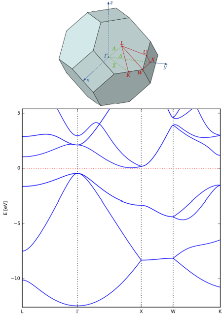

# Tutorial 2 – Periodic Systems

### 📘**Introduction** 

Periodic systems form the foundation of solid-state physics and materials science. Unlike isolated molecules, crystals have translational symmetry that extends infinitely in space, requiring special computational techniques to handle their electronic structure.

In this tutorial, we will explore:

* **Periodic boundary conditions (PBCs)** and how they transform our computational approach
* **k-point sampling** of the Brillouin zone and convergence testing
* **Electronic band structures** and density of states (DOS) to understand material properties
* **Metallic vs. semiconducting behavior** through electronic structure analysis
* **Computational efficiency** trade-offs between different exchange-correlation functionals

---

> **Please Note**
> - Distances are in Å
> - The arguments or discussion in all you assignments should be supported by **data**, **tables** or preferably **graphs**.
> - Activate your virtual env if the python script needs ase.
> - **All input/output files and scripts used for the performance of hands-on assignments and the final project should be placed in an organized directory and available for review. A README file explaining what all the files are should be placed in the directory.**
> - Please find `submit.sh` and `write_control.py` in `utils/trace` or `utils/arjuna` folder.
> - Please find any other useful python scripts under Tutorial_1 and subfolders.

## Preparation 

- **Enter folder and run bash script**
  ```bash
  cd Tutorial_2
  bash dir_tree.sh
  ```
---

## EX1  Silicon & Sodium (Si / Na)

### **1.1 Build the unit cells**
The Si structure has a [Diamond-cubic (DC)](https://msestudent.com/diamond-cubic-unit-cell/) crystal structure (Si, 8 atoms in conventional cell) and Na has a [Body-centered-cubic (BCC)](https://msestudent.com/body-centered-cubic-bcc-unit-cell/) crystal structure (Na, 2 atoms in conventional cell).
**Enter kpts folder**
  ```bash
  cd ./Si_Na/Si/kpts
  ```
**Manually Write `geometry.in`**:

- Use the **starting** lattice constants (5.5 Å for Si, 4.5 Å for Na). Add three `lattice_vector` lines—this turns on PBCs.;
    ```
    # Periodic cell (Å)
    lattice_vector  ax ay az   
    lattice_vector  bx by bz   
    lattice_vector  cx cy cz  
    ```
    * `ax … cz` are the **Cartesian components in ångström**.
    * To convert lattice parameters (a,b,c,α,β,γ) to Cartesian vectors, you could use:
    
      ```bash
      from ase.geometry import cellpar_to_cell
      print(cellpar_to_cell([a,b,c,α,β,γ]))
      ```  

-  **Place atoms in fractional coordinates:**  
    Always use `atom_frac` to start the line if you use fractional coordinates, each line should looks like this format:
    ```text
    atom_frac 0.5 0.5 0.5 Si
    ```
**Write `geometry.in` Automatically**:

Or you could try to use `ase` to create Atoms object and write your geometry.in file, for example:
  ```bash
  from ase.build import bulk
  from ase.io import write
  si_dc_prim = bulk('Si', crystalstructure='diamond', a=5.5)
  si_dc_conv = bulk('Si', crystalstructure='diamond', a=5.5, cubic=True)
  na_bcc_prim = bulk('Na', crystalstructure='bcc', a=4.5)
  na_bcc_conv = bulk('Na', crystalstructure='bcc', a=4.5, cubic=True)
  write("geometry.in",si_dc_prim)
  write("geometry_prim.in",si_dc_prim)
  write("geometry_conv.in",si_dc_conv)
  ```
**Compare primitive cell and conventional cell:**

- **Primitive cell**: The smallest repeating unit that contains exactly one lattice point. It has the minimum number of atoms needed to represent the crystal structure through translation symmetry.
  - Si diamond-cubic primitive: 2 atoms
  - Na BCC primitive: 1 atom

- **Conventional cell**: A larger unit cell chosen for convenience, often with higher symmetry that makes the crystal structure easier to visualize and understand, but contains multiple lattice points.
  - Si diamond-cubic conventional: 8 atoms (4× primitive)
  - Na BCC conventional: 2 atoms (2× primitive)

The primitive cell is computationally more efficient (fewer atoms = faster calculations), while the conventional cell better displays the crystal symmetry and is often preferred for visualization and structural analysis.

**Visual-check in **OVITO**.**

### **1.2 K-point convergence test**

DFT codes for periodic systems like FHI-aims sample wave functions at several discrete points in [reciprocal space](https://en.wikipedia.org/wiki/Reciprocal_lattice), what we called k-points, inside the [Brillouin zone](https://en.wikipedia.org/wiki/Brillouin_zone). 

**Why do we need to sample k-points?**

In periodic systems, the electronic wave functions have the form of Bloch waves: ψ(r) = e^(ik·r) u(r), where u(r) has the same periodicity as the crystal lattice. The wave vector k can take any value within the first Brillouin zone, creating a continuous spectrum of electronic states. However, computationally we cannot evaluate the wave function at every possible k-point—there are infinitely many!

Instead, we approximate the continuous k-space by sampling at a finite grid of discrete k-points. The total energy and other properties are then calculated as weighted averages over this k-point mesh. A denser k-point grid gives more accurate results but requires more computational time. The key is finding the optimal balance: a grid dense enough for convergence but not so dense that calculations become prohibitively expensive.

Therefore, we need to perform a **convergence test** to determine the optimal k-point mesh density. This involves systematically increasing the k-point grid size and monitoring how the total energy changes until it stabilizes. Choosing a properly converged k-point mesh is crucial—the accuracy of all subsequent calculations (relaxations, band structures, and DOS plots) for Si and Na depends on this foundational step.

**Create the `control.in`**:

  ```bash
  python write_control.py --elements Si
  ```
  The control.in setting should looks like:

  ```text
  control.in:
    xc            pw-lda         # xc-functional : plane wave LDA
    spin          none           # non-magnetic
    relativistic  none
    charge        0.
    k_grid        n n n          # test n = 4,5,…,12
  ```
  Convergence test is to run single-point calculations for each k grid `n` from 4-12, collect total energies, and plot E and |dE/dn| (numerical derivative) vs. `n`; choose the smallest `n` where both flatten.

**Copy submit.sh to current folder.**

  For your convenience, you can always this command to create and submit jobs for all k_grid automatically:

  ```bash
  python Automation.py --make_k_grid
  ```
  After the job finished, use this command to plot the convergence curve automatically:

  ```bash
  python Automation.py --plot_k_grid
  ```


### **1.3 Lattice relaxation**
**Relaxation Preparation**

  ```bash
  cd ../relax
  cp ../kpts/geometry.in .
  python write_control.py --elements Si 
  ```
**Copy submit.sh to current folder and `sbatch submit.sh` to submit the job.**

Add the converged `k_grid` setting into `control.in`, also add these settings for periodic relaxation:

  ```bash
  k_grid n n n
  relax_geometry  bfgs 1e-2 
  relax_unit_cell fixed_angles # fixed_angles or full
  ```
*bfgs: optimization type (same as trm)*

*1e-2 :the maximum force tolerance per atom (in eV/Å) to be considered converged.*

**Get the relaxed lattice constant**

Run this comand:
```bash
python Automation.py --get_lattice_constant
```
You will extract structure information from `geometry.in.next_step` in your current folder automatically, if you want to extract from other files , add `--lattice_file_name <your_filename>` to this command.


### **1.4 Band structure & DOS**

To calculate the band structure and determine the band gap, we need to sample the electronic states along specific paths in k-space. Rather than calculating bands at random k-points, we choose a **k-path** that connects high-symmetry points in the Brillouin zone. 

These **high-symmetry points** are special locations where the crystal's symmetry operations (rotations, reflections, inversions) leave the k-point unchanged or map it to an equivalent point. Due to the crystal's symmetry, many k-points in the Brillouin zone are equivalent—they yield identical electronic eigenvalues and properties. This symmetry allows us to reduce our computational domain to the **irreducible Brillouin zone** (IBZ), which contains only the unique, non-equivalent k-points. The high-symmetry points themselves are located at the boundaries and corners of the IBZ, representing the most symmetric locations within this reduced zone.

By sampling only the IBZ instead of the full Brillouin zone, we avoid redundant calculations of duplicate electronic states, significantly reducing computational cost while maintaining full accuracy. The high-symmetry points often correspond to critical locations where band extrema (valence band maxima and conduction band minima) occur, making them essential for determining band gaps and electronic properties.

By plotting the band structure along paths connecting these high-symmetry points, we can efficiently capture the essential electronic behavior of the material while leveraging crystal symmetry to minimize computational effort. The k-path linking high-symmetry points in the Brillouin zone:

  * **FCC Si(primitive cell)**: L-Γ-X-W-K.
  * **BCC Na(primitive cell)**: N-Γ-H-N-P.




**Figure1 :** L-Γ-X-W-K band structure of Silicon (bottom) and FCC Brillouin zone illustration(top) of primitive cell.

**Enter band folder and Prepare `control.in`**
  ```bash
  cd ../band
  python write_control.py --elements Si
  ```
**Add Bandgap Settting manually**
  Add the converged `k_grid` and bandgap/dos setting into `control.in`:
  ```text
  k_grid n n n

  # ------------ Band structure  ----------------------------
  exx_band_structure_version 1  
  output band   <kx1 ky1 kz1>   <kx2 ky2 kz2>   <Npts>   <start>   <end>
  # ------------ Density of States -------------------------------------
  # Density-of-states: 2000 points from −18 eV up to the Fermi level
  output dos_tetrahedron   -18.0   0.0   2000
  ```
  The arguments after `output band` are defined here:
  - kx ky kz  – fractional coordinates of the start / end points.
  - Npts      – number of k-points *along this segment* (≥10 gives smooth lines).
  - start/end    – label of the high symmetry K points.

Choose the High-symmetry points according to the cell type (primitive&conventional) in your `geometry.in` for consistency.
The following tables([source](https://lampz.tugraz.at/~hadley/ss1/bzones)) give you the frac coordinate of high symmetry points in FCC and BCC (primitive cell):

**Table 1 – High-symmetry points for the FCC Brillouin zone (primitive cell)**

|   Point   | *k*<sub>x</sub> | *k*<sub>y</sub> | *k*<sub>z</sub> |
| :-------: | :-------------: | :-------------: | :-------------: |
|     L     |       0.5       |       0.5       |       0.5       |
|   Gamma   |       0.0       |       0.0       |       0.0       |
|     X     |       0.0       |       0.5       |       0.5       |
|     W     |       0.25      |       0.75      |       0.5       |
|     K     |      0.375      |       0.75      |      0.375      |

---

**Table 2 – High-symmetry points for the BCC Brillouin zone (primitive cell)**

|   Point   | *k*<sub>x</sub> | *k*<sub>y</sub> | *k*<sub>z</sub> |
| :-------: | :-------------: | :-------------: | :-------------: |
|     N     |       0.0       |       0.5       |       0.0       |
|   Gamma   |       0.0       |       0.0       |       0.0       |
|     H     |       -0.5      |       0.5       |       0.5       |
|     P     |       0.25      |       0.25      |       0.25      |

---
FCC example: L → Γ → X → W → K, 21 points on each leg:
```text
output band   0.5 0.5 0.5    0.0 0.0 0.0    21   L       Gamma
output band   0.0 0.0 0.0    0.0 0.5 0.5    21   Gamma   X
output band   0.0 0.5 0.5    0.25 0.75 0.5  21    X      W
output band   0.25 0.75 0.5  0.375 0.75 0.375  21    W    K
```

We will run the test with relaxed structure after step 1.3, by renaming the `geometry.in.next_step` to `geometry.in`, add it and the `submit.sh` to current `./band` path, then submit the job by `sbatch submit.sh`.
  ```bash
  cp ../relax/geometry.in.next_step ./geometry.in
  ```

After the run finishes, use `aimsplot.py` to plot the band structure and density of states (DOS).
Run `python aimsplot.py --help` for full flag descriptions and to customize the figure appearance.

---

**Add Bandgap Settting Automatically**

The [Graphical Interface for Materials Simulation (GIMS)](https://gims.ms1p.org/static/index.html#) provides an automated platform for building crystal structures, choose `Band Structure workflow`, generating `control.in` files, and performing post-processing tasks such as band structure and DOS analysis.

Once you're familiar with how it works, you can use this tool to streamline your research workflow.

---

### **Assignment 1** Si & Na. (40 points)

* (7 points) Perform a convergence test by running single-point calculations for each k-grid density `n` from 4 to 12. Collect the total energies and plot both E and |dE/dn| (numerical derivative) versus `n`. Choose the smallest `n` where both curves flatten out. Determine the number of k-points you consider converged. Note: the convergence behavior can differ between materials.

* (3 points) With converged k-points settings, optimize the lattice constant of each material. Compare your results with experimental values. The relaxed *a* to experiment (Si ≈ 5.43 Å, Na ≈ 4.225 Å).

* (10 points) With converged k-points settings and optimized lattice constant plot the band structure and density of states of each material.

* (10 points) Extract the band gap of Si (diamond cubic) from your band structure and analyze the electronic properties of both Na (BCC) and Si (diamond cubic). No bandgap for metal. Compare your calculated band gaps to experimental values and cite your sources. Additionally, compare your DFT band structure of Si with results obtained using the GW method to understand the limitations of DFT in predicting band gaps. Support all results with clear graphs and tabulated data. Draw meaningful conclusions from these comparisons and discuss the physical origins of any discrepancies. Reference papers: [Si](https://www.jstage.jst.go.jp/article/matertrans/51/12/51_M2010303/_article) and [Na](https://journals.aps.org/prb/abstract/10.1103/PhysRevB.55.15544).

* (10 points) Discuss the differences between a metal and a semiconductor. How can you determine if a material is a metal or a semiconductor based on the band structure and DOS? Did you find any differences in the k-point convergence behavior?

---

## EX2  BCC/FCC Iron (Fe)

### **2.1 Build Geometry.**
Iron (Fe) has an atomic number of 26 and, at atmospheric pressure and under
1184 K, a BCC Bravais lattice. At atmospheric pressure and between
1184 K and 1665 K, Iron takes on an FCC. Iron is a conductor and a metal.

- **Create `BCC.in` and `FCC.in` (atom frac format) according to the **table 3**.**

---
**Table 3 –  BCC Iron and FCC Iron**

| Species | Atomic Number | Lattice | Starting Lattice Constant (Å) |
|---------|----------------|---------|-------------------------------|
| Iron    | 26             | BCC     | 3.0                           |
| Iron    | 26             | FCC     | 3.5                           |

---
- **Build use ase**
You could build the structure from scratch using `atom_frac`, but you could also `ase` to build you structure, for example:
  ```bash
  from ase.build import bulk
  # BCC Iron with lattice constant 3.0 Å
  iron_bcc_prim = bulk('Fe', crystalstructure='bcc', a=3.0)
  iron_bcc_conv = bulk('Fe', crystalstructure='bcc', a=3.0, cubic= True)
  # FCC Iron with lattice constant 3.5 Å
  iron_fcc_prim = bulk('Fe', crystalstructure='fcc', a=3.5)
  iron_fcc_conv = bulk('Fe', crystalstructure='fcc', a=3.5, cubic= True)

  #write it into geometry.in
  from ase.io import read,write
  write("geometry.in",iron_bcc_prim)
  ```
### **2.2 k-point convergence**

  ```bash
  python write_control.py --elements Fe
  ```

Same protocol as EX1 , but rebuild the `control.in` with Fe species, set `relativistic atomic_zora scalar`,`spin none` and different `k_grid` in `control.in` and test both lattices;
- `relativistic atomic_zora scalar` is used to account for relativistic effects in atoms — especially heavy element, whose atomic number is greater than 20 — without including spin-orbit coupling.

For your convenience, you can use this command to create and submit jobs for all k_grid values automatically. You can estimate a rough range of k_grid satisfying `N*a > 40`:

  ```bash
  python Automation.py --make_k_grid --k_grid_min 10 --k_grid_max 18
  ```
After the job finished, use this command to plot the convergence curve automatically:

  ```bash
  python Automation.py --plot_k_grid
  ```

### **2.3 Energy vs. lattice constant**
After you get converged k_grid, scan through different lattice constant *a* (try 2.0-4.5Å ,with step 0.25 Å), for each combination: (BCC | FCC) × (non-magnetic | magnetic state) using LDA or PBE xc-functionals. 

You can use our automation script to save your effort, lattice type can be `bcc` or `fcc`, always prepare `submit.sh`,`control.in` before running this command. for example:
  ```bash
  mkdir lattice_grid
  cd lattice_grid
  cp ../submit.sh .
  cp ../control.in .
  ```
**Remember to add k_grid to `control.in` file !**

  ```bash
  python Automation.py --Fe_grid_search --lattice_type bcc
  ```

After the calculation finished, use this command to plot E vs lattice constant automatically:
  ```bash
  python Automation.py --plot_Fe_grid_search
  ```
**Hint:** 
- To use PBE as the exchange-correlation functional, simply change `xc pw-lda` to `xc pbe` in the `control.in` file.
- To consider the system in a magnetic state, set `spin collinear` in `control.in` and specify initial magnetic moments in `geometry.in`. If you use ASE to generate `geometry.in`, the `initial_moment` parameter should be included automatically.
  - Initial moments represent the initial guess for the [magnetic moment](https://en.wikipedia.org/wiki/Magnetic_moment) used in [spin polarization](https://en.wikipedia.org/wiki/Spin_polarization) calculations, specified in [Bohr magnetons (μB)](https://en.wikipedia.org/wiki/Bohr_magneton). For iron, use an initial moment of 2 μB per atom. 
  - When using fractional coordinates, the `geometry.in` file should look like:
    ```text
    atom_frac	0.0	0.0	0.0	Fe
    initial_moment	2
    atom_frac	0.5	0.5	0.0	Fe
    initial_moment	2
    ```

### **2.4 Band structure**
- Relax the ground state structure for magnetic BCC iron using PBE in §2.3 as you learned in §1.3.
- Use what you learned in §1.4 to make a band structure and density of states figure for the relaxed structure. You can also simply input the aims calc folder to GIMS to automatically plot the graphs. Among FHI-aims output files, band10XX represents spin up data, band20XX represents spin down data.


### **Assignment 2** BCC/FCC Iron (20 Points)
* (5 points) Carry out k-points convergence test for both BCC and FCC iron structures.
* (5 points) With converged k-points settings, plot the total energy vs. lattice parameter for *ferromagnetic* and *non-magnetic* Fe in both *FCC* and *BCC* structures using the *LDA* and *PBE GGA* functionals. Compare your results to the experimental lattice parameter and magnetic moment of BCC Fe, [ref paper](https://www.nature.com/articles/s41524-021-00649-8). Discuss whether you obtained the correct ground state of Fe using these two functionals.
* (5 points) For the ground state structure, relax the geometry and plot the *spin-polarized* band structure and *DOS* for magnetic BCC Fe. Note that spin-polarized calculations use `spin collinear` in the `control.in` file. 
* (5 points) Compare your band structure of BCC iron to Figure 1 of the [research paper](https://www.nature.com/articles/s41524-021-00649-8).

---

## EX3  Germanium (Ge)
Germanium (Ge) has an atomic number of 32 and an FCC — but more
specifically, diamond cubic (DC) —Bravais lattice. Germanium is in
Group 14 of the periodic table of elements—the same group as Silicon. Germanium is a semiconductor and a semimetal.

### **3.1 Build diamond-cubic cell**
Make geometry.in file for DC Germanium according to Table 4.

**Table 4 :** Information of Germanium.

| Species    | Atomic Number | Lattice   | Starting Lattice Constant (Å) |
|------------|----------------|-----------|-------------------------------|
| Germanium  | 32             | FCC (DC)  | 5.5                           |

---

```bash
from ase.io import read, write
from ase import Atoms
from ase.build import bulk

# Build diamond-cubic Germanium structure
ge_dc = bulk('Ge', crystalstructure='diamond', a=5.5)
write('geometry.in', ge_dc)

```

---

### **3.2 Exchange-correlation functionals**
**! Remember to set `relativistic atomic_zora scalar` in `control.in`**

- [LDA](https://journals.aps.org/prl/abstract/10.1103/PhysRevLett.45.566) (Local Density Approximation): LDA assumes the exchange–correlation energy depends only on the local electron density, similar to a uniform electron gas. It's fast and simple but tends to overbind and is less accurate for inhomogeneous systems. Set `xc pw-lda` in `control.in`.

- [PBE-GGA](https://journals.aps.org/prl/abstract/10.1103/PhysRevLett.77.3865) (Perdew–Burke–Ernzerhof): PBE is a GGA functional that includes both the electron density and its gradient, offering improved accuracy over LDA for molecular and solid-state systems. It is widely used but still underestimates band gaps.Set `xc pbe` in `control.in`.
- [SCAN](https://journals.aps.org/prl/abstract/10.1103/PhysRevLett.115.036402) (Strongly Constrained and Appropriately Normed): SCAN is a meta-GGA functional that incorporates kinetic energy density, achieving higher accuracy across diverse systems. It improves structural and energetic predictions but is more computationally demanding. Set `xc scan` in `control.in`

- [HSE06](https://pubs.aip.org/aip/jcp/article-abstract/118/18/8207/460359/Hybrid-functionals-based-on-a-screened-Coulomb?redirectedFrom=fulltext) (Heyd–Scuseria–Ernzerhof 2006): HSE06 is a hybrid functional that mixes exact exchange with PBE, significantly improving electronic structure predictions like band gaps. It is accurate but computationally intensive, making it suitable for small- to medium-sized systems. 

    ```text
    xc hse06 0.11 
    hse_unit bohr 
    ```
    0.11 is [screening parameter](https://pubs.aip.org/aip/jcp/article-abstract/125/22/224106/953719/Influence-of-the-exchange-screening-parameter-on?redirectedFrom=fulltext) omega, hse_unit defines the unit of omega.

### **3.3 Test with different xc-functionals.**

- Do k-point convergence test with LDA.
- For each functional LDA PBE-GGA SCAN HSE06:
  - Do lattice relaxation, record CPU time. 
  - Plot band structure and density of states, record CPU Time.
  - Compare gaps with [experimental result](https://www.researchgate.net/publication/299490580_DETERMINATION_OF_THE_BAND-GAP_OF_A_SEMICONDUCTOR_GERMANIUM_CHIP_USING_FOUR_PROBE_SET-UP) (~0.693 eV) and [GW](https://journals.aps.org/prb/abstract/10.1103/PhysRevB.48.17791) results, discuss Jacob’s-Ladder accuracy vs. cost.

### **Assignment 3**: Germanium Electronic Structure Analysis (30 Points)

**Part 1: Lattice Parameter Optimization (10 Points)**
- Using converged k-point settings, perform lattice parameter relaxation with all four exchange-correlation functionals.  
- Compare your optimized lattice parameters to the experimental value (5.658 Å). Cite appropriate literature sources for experimental data.

**Part 2: Electronic Structure Analysis (20 Points)**
- For each functional, calculate and plot the band structure and density of states (DOS) at the equilibrium lattice parameter.
- Extract the fundamental band gap from your calculations
- Compare your calculated band gaps to:
  - Experimental value (~0.693 eV at room temperature)
  - GW results from Rohlfing et al. 
- Analyze the performance of different functional classes using Perdew's ladder framework:
  - Discuss accuracy trends across LDA → GGA → meta-GGA → hybrid functionals.
  - Compare and draw conclusions about the trade-offs between accuracy and computational cost.


### **Assignment 4**  Accuracy vs Cost Evaluation (10 Points)

Select one material and one exchange-correlation functional from your previous calculations. Compute and compare between sparse and dense k-point grids (for example: 4 and 10):

* (3 Points) For the same material and functional, create overlay plots comparing:
  - Band structures calculated with sparse vs. dense k-point grids
  - Density of states (DOS) with different k-point sampling
* (2 Points) Quantitatively compare key properties:
  - Relaxed lattice constant
  - Band gap values (for semiconductors)
  - Magnetic moments (for magnetic materials)
  - Any other relevant electronic properties

* (5 Points) Analyze the trade-offs between computational efficiency (time) and accuracy when selecting k-point grids
  - Discuss practical considerations for choosing appropriate k-point sampling in different scenarios
  - Provide recommendations for balancing accuracy requirements with available computational resources
---