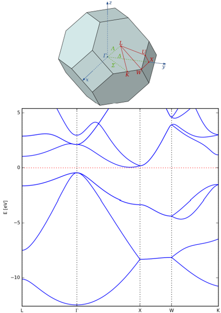

# Tutorial 3 – Periodic Systems

---

## Learning Objectives
- Apply periodic-boundary conditions (PBCs) in **FHI-aims**,
- Decide on a **k-point mesh** via convergence testing,
- Distinguish **metals vs. semiconductors** from band-structure / DOS plots,
- Generate band structures & density of states (DOS)
- Compare the cost / accuracy of **semi-local vs. hybrid** functionals.;

---

## 0 Preparation 
Log into **Arjuna**, create a folder, then run  `./dir_tree.sh` to spawn the ready-made directory scaffold (Si, Na, Fe, Ge, …).;
Activate the [conda environment](../../HPC%20Onboard/virtual_env) `ase_env` you have created.

---

## 1  Silicon & Sodium (Si / Na)

### 1.1 Build the unit cells

*Write `geometry.in`*:

1. Use the **starting** lattice constants (5.5 Å for Si, 4.5 Å for Na). Add three `lattice_vector` lines—this turns on PBCs.;
    ```
    # Periodic cell (Å)
    lattice_vector  ax ay az   
    lattice_vector  bx by bz   
    lattice_vector  cx cy cz  
    ```
    * `ax … cz` are the **Cartesian components in ångström**.
    * To convert lattice parameters (a,b,c,α,β,γ) to Cartesian vectors, you could use `ase.geometry.cellpar_to_cell([a,b,c,α,β,γ])`.

2.  Place atoms in fractional coordinates: [Diamond-cubic (DC)](https://msestudent.com/diamond-cubic-unit-cell/) (Si, 8 atoms in conventional cell) and [Body-centered-cubic (BCC)](https://msestudent.com/body-centered-cubic-bcc-unit-cell/) (Na, 2 atoms in conventional cell). 
Always use `atom_frac` to start the line if you use fractional coordinates, each line should looks like this format:
```text
atom_frac 0.5 0.5 0.5 Si
```
Or you could try to use `ase` to create Atoms object and write your geometry.in file, for example:
```bash
from ase.build import bulk
si_dc_prim = bulk('Si', crystalstructure='diamond', a=5.5)
si_dc_conv = bulk('Si', crystalstructure='diamond', a=5.5, cubic=True)
na_bcc_prim = bulk('Na', crystalstructure='bcc', a=4.5)
na_bcc_conv = bulk('Na', crystalstructure='bcc', a=4.5, cubic=True)
from ase.io import write
write("geometry.in",si_dc_prim)
```
3. Visual-check in **OVITO**.

### 1.2 k-point convergence

DFT codes for periodic systems like FHI-aims sample wave functions at several discrete points in [reciprocal space](https://en.wikipedia.org/wiki/Reciprocal_lattice), what we called k-points, inside the [Brillouin zone](https://en.wikipedia.org/wiki/Brillouin_zone). First pick a converged k-point mesh—the accuracy of all subsequent relaxations, band structures, and DOS plots for Si and Na depends on that grid.

First create the `control.in` draft that have Si or Na species info, eg:
```bash
python write_control.py --elements Si --species_default light
```
The control.in setting should looks like:

```text
control.in:
  xc            pw-lda         # xc-functional : plane wave LDA
  spin          none           # non-magnetic
  relativistic  none
  charge        0.
  k_grid        n n n          # test n = 4,5,…,12
```
Run single-point calculations for each k grid `n`, collect total energies, and plot E and |dE/dn| (numerical derivative) vs. `n`; choose the smallest `n` where both flatten.;

### 1.3 Lattice relaxation

Copy the converged `k_grid` into `relax/control.in`, add this for periodic relaxation

```
relax_geometry  bfgs 1e-2 
# bfgs: optimization type (same as trm) 
# 1e-2 :the maximum force tolerance per atom (in eV/Å) to be considered converged.
relax_unit_cell fixed_angles # fixed_angles or full
```

then run relaxation until forces fall below 0.01 eV Å⁻¹. Compare the relaxed *a* to experiment (Si ≈ 5.43 Å, Na ≈ 4.29 Å).;

### 1.4 Band structure & DOS

First, we need to pick a kpath linking high-symmetry points in the
Brillouin zone:

* **FCC Si(primitive cell)**: L-Γ-X-W-K.
* **BCC Na(primitive cell)**: N-Γ-H-N-P.




**Figure1 :** L-Γ-X-W-K band structure of Silicon (bottom) and FCC Brillouin zone illustration(top) of primitive cell.
Add the following to **`control.in`**:
```text
# ------------ Band structure  ----------------------------
exx_band_structure_version 1  
output band   <kx1 ky1 kz1>   <kx2 ky2 kz2>   <Npts>   <start>   <end>
# ------------ Density of States -------------------------------------
# Density-of-states: 2000 points from −18 eV up to the Fermi level
output dos_tetrahedron   -18.0   0.0   2000
```
The arguments after `output band` are defined here:
- kx ky kz  – fractional coordinates of the start / end points.
- Npts      – number of k-points *along this segment* (≥10 gives smooth lines).
- start/end    – label of the high symmetry K points.

Choose the High-symmetry points according to the cell type (primitive&conventional) in your `geometry.in` for consistency.
The following tables([source](https://lampz.tugraz.at/~hadley/ss1/bzones)) give you the frac coordinate of high symmetry points in FCC and BCC (primitive cell):

**Table 1 – High-symmetry points for the FCC Brillouin zone (primitive cell)**

|   Point   | *k*<sub>x</sub> | *k*<sub>y</sub> | *k*<sub>z</sub> |
| :-------: | :-------------: | :-------------: | :-------------: |
|     L     |       0.5       |       0.5       |       0.5       |
|   Gamma   |       0.0       |       0.0       |       0.0       |
|     X     |       0.0       |       0.5       |       0.5       |
|     W     |       0.25      |       0.75      |       0.5       |
|     K     |      0.375      |       0.75      |      0.375      |

---

**Table 2 – High-symmetry points for the BCC Brillouin zone (primitive cell)**

|   Point   | *k*<sub>x</sub> | *k*<sub>y</sub> | *k*<sub>z</sub> |
| :-------: | :-------------: | :-------------: | :-------------: |
|     N     |       0.0       |       0.5       |       0.0       |
|   Gamma   |       0.0       |       0.0       |       0.0       |
|     H     |       -0.5      |       0.5       |       0.5       |
|     P     |       0.25      |       0.25      |       0.25      |

---
FCC example: L → Γ → X, 21 points on each leg:
```text
output band   0.5 0.5 0.5    0.0 0.0 0.0    21   L       Gamma
output band   0.0 0.0 0.0    0.0 0.5 0.5    21   Gamma   X
```

We will run the test with relaxed structure after step 1.3, by renaming the `geometry.in.next_step` to `geometry.in`, add it and the `submit.sh` to current `./band` path, then submit the job.

After the run finished, plot with `aimsplot.py`  to obtain bands and DOS.
Run ``python aimsplot.py --help`` for full flag descriptions.

---

### 1.5 Too Complex? Automate It Easily

The [Graphical Interface for Materials Simulation (GIMS)](https://gims.ms1p.org/static/index.html#) provides an automated platform for building crystal structures, generating `control.in` files, and performing post-processing tasks such as band structure and DOS analysis.

Once you're familiar with how it works, you can use this tool to streamline your research workflow.

---


### 1.6 Quick self-check (Si & Na)

1. Plot Convergence plot → chosen k-mesh.
2. Compare optimised lattice constants vs. literature.
3. Plot Band structure + DOS for each material.
4. Si: report band gap, compare to experiment & GW reference.
5. Discuss metal vs. semiconductor signatures and any difference in k-point behaviour.

---

## 2  BCC/FCC Iron (Fe)

### 2.1 Build Geometry.
Iron (Fe) has an atomic number of 26 and, at atmospheric pressure and under
1184 K, a BCC Bravais lattice. At atmospheric pressure and between
1184 K and 1665 K, Iron takes on an FCC. Iron is a conductor and a metal.

**TODO:** Create `BCC.in` and `FCC.in` (atom frac format) according to the **table 3**.

---
**Table 3 –  BCC Iron and FCC Iron**

| Species | Atomic Number | Lattice | Starting Lattice Constant (Å) |
|---------|----------------|---------|-------------------------------|
| Iron    | 26             | BCC     | 3.0                           |
| Iron    | 26             | FCC     | 3.5                           |

---
You could build the structure from scratch using `atom_frac`, but you could also `ase` to build you structure, for example:
```bash
from ase.build import bulk
# BCC Iron with lattice constant 3.0 Å
iron_bcc_prim = bulk('Fe', crystalstructure='bcc', a=3.0)
iron_bcc_conv = bulk('Fe', crystalstructure='bcc', a=3.0, cubic= True)
# FCC Iron with lattice constant 3.5 Å
iron_fcc_prim = bulk('Fe', crystalstructure='fcc', a=3.5)
iron_fcc_conv = bulk('Fe', crystalstructure='fcc', a=3.5, cubic= True)

#write it into geometry.in
from ase.io import read,write
write("geometry.in",iron_bcc_prim)
```
### 2.2 k-point convergence

Same protocol as §1.2, but rebuild the `control.in` with Fe species, set `relativistic atomic_zora scalar`,`spin none` and different `k_grid` in `control.in` and test both lattices;
- `relativistic atomic_zora scalar` is used to account for relativistic effects in atoms — especially heavy element, whose atomic number is greater than 20 — without including spin-orbit coupling.

### 2.3 Energy vs. lattice constant
After you selected k_grid density, scan through different lattice constant *a* (try 2.0-4.5Å ,with step 0.25 Å), for each combination: (BCC | FCC) × (non-magnetic | magnetic state) using LDA or PBE xc-functionals. 

**TODO:** Plot energy-vs-*a* curves for each combination and identify the ground state, compare the ground state predicted by LDA with by PBE.

**Hint:** 
- Simply change `xc pbe` in control.in file to use PBE as xc-functional. 
- Set `spin collinear` in control.in and initial moments (in geometry.in) to 2 (If you use ase code to generate `geometry.in`, the `initial_moment` should be given, you do not need to change it), to consider system in magnetic state. 
  - Initial moments refers to the initial guess of [magnetic moment](https://en.wikipedia.org/wiki/Magnetic_moment) for the [spin polarization](https://en.wikipedia.org/wiki/Spin_polarization) on each atom in [Bohr magnetons (μB)](https://en.wikipedia.org/wiki/Bohr_magneton). Setting in `geometry.in` should looks like (if use fractional coordinate):
  ```text
  atom_frac	0.0	0.0	0.0	Fe
  initial_moment	2
  atom_frac	0.5	0.5	0.0	Fe
  initial_moment	2
  ```

### 2.4 Band structure
- Relax the ground state structure for magnetic BCC iron using PBE in §2.3 as you learned in §1.3 and §1.5.
- Use what you learned in §1.4 to make a band structure and density of states figure for the relaxed structure. You can also simply input the aims calc folder to [GIMS](../../Utilities/) to automatically plot the graphs.
- Compare your band structure to Figure 1 of the [research paper](https://www.nature.com/articles/s41524-021-00649-8). Among FHI-aims output files, band10XX represents spin up data, band20XX represents spin down data.

### 2.5  Quick self-check (BCC/FCC Fe)
- With converged k-points settings, plot the total energy vs. lattice parame-
ter for ferromagnetic and non-magnetic Fe in the FCC and BCC structures
using the LDA and the PBE GGA functionals. Compare your results to
the experimental lattice parameter and the magnetic moment of BCC Fe.
Discuss whether or not you obtained the correct ground state of Fe using
these two functionals.
- Plot the spin-polarized band structure and DOS for magnetic BCC Fe.

---

## 3  Germanium (Ge)
Germanium (Ge) has an atomic number of 32 and an FCC — but more
specifically, diamond cubic (DC) —Bravais lattice. Germanium is in
Group 14 of the periodic table of elements—the same group as Silicon. Germanium is a semiconductor and a semimetal.
### 3.1 Build diamond-cubic cell
Make geometry.in file for DC Germanium according to Table 4.

**Table 4 :** Information of Germanium.

| Species    | Atomic Number | Lattice   | Starting Lattice Constant (Å) |
|------------|----------------|-----------|-------------------------------|
| Germanium  | 32             | FCC (DC)  | 5.5                           |

---

### 3.2 Exchange-correlation functionals
- [LDA](https://journals.aps.org/prl/abstract/10.1103/PhysRevLett.45.566) (Local Density Approximation): LDA assumes the exchange–correlation energy depends only on the local electron density, similar to a uniform electron gas. It's fast and simple but tends to overbind and is less accurate for inhomogeneous systems. Set `xc pw-lda` in `control.in`.

- [PBE-GGA](https://journals.aps.org/prl/abstract/10.1103/PhysRevLett.77.3865) (Perdew–Burke–Ernzerhof): PBE is a GGA functional that includes both the electron density and its gradient, offering improved accuracy over LDA for molecular and solid-state systems. It is widely used but still underestimates band gaps.Set `xc pbe` in `control.in`.
- [SCAN](https://journals.aps.org/prl/abstract/10.1103/PhysRevLett.115.036402) (Strongly Constrained and Appropriately Normed): SCAN is a meta-GGA functional that incorporates kinetic energy density, achieving higher accuracy across diverse systems. It improves structural and energetic predictions but is more computationally demanding. Set `xc scan` in `control.in`


- [HSE06](https://pubs.aip.org/aip/jcp/article-abstract/118/18/8207/460359/Hybrid-functionals-based-on-a-screened-Coulomb?redirectedFrom=fulltext) (Heyd–Scuseria–Ernzerhof 2006): HSE06 is a hybrid functional that mixes exact exchange with PBE, significantly improving electronic structure predictions like band gaps. It is accurate but computationally intensive, making it suitable for small- to medium-sized systems. 

    ```text
    xc hse06 0.11 
    hse_unit bohr 
    ```
    0.11 is [screening parameter](https://pubs.aip.org/aip/jcp/article-abstract/125/22/224106/953719/Influence-of-the-exchange-screening-parameter-on?redirectedFrom=fulltext) omega, hse_unit defines the unit of omega.

### 3.3 Test with different xc-functionals.

- Do k-point convergence test with LDA.
- For each functional LDA PBE-GGA SCAN HSE06:
  - Do lattice relaxation, record CPU time. 
  - Plot band structure and density of states, record CPU Time.
  - Compare gaps with [experimental result](https://www.researchgate.net/publication/299490580_DETERMINATION_OF_THE_BAND-GAP_OF_A_SEMICONDUCTOR_GERMANIUM_CHIP_USING_FOUR_PROBE_SET-UP) (~0.693 eV) and [GW](https://journals.aps.org/prb/abstract/10.1103/PhysRevB.48.17791) results, discuss Jacob’s-Ladder accuracy vs. cost.

### 3.4 Quick self-check(Ge)

- Relax the lattice parameter using LDA, PBE (GGA), SCAN (meta-GGA), and HSE06 (hybrid) with converged k-points.
- Compare relaxed values to experimental lattice constant and cite your sources.
- For each functional, plot the band structure and DOS at the relaxed lattice parameter.
- Extract the band gap from the plots and compare it to the experimental value and GW result.
- Discuss functional performance using Jacob’s-Ladder classification.
- For each functional, extract the time per SCF iteration, multiply by number of CPUs, and compare costs.

## 4  Accuracy vs Cost Evaluation

- Choose one material and functional, then compare SCF cost between sparse and dense k-point grids.

- Superimpose band structures and DOS from sparse vs. dense k-point calculations; compare band gaps and, if magnetic, magnetic moments.

- Discuss trade-offs between accuracy and computational cost in choosing k-point grids.

---