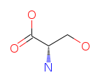
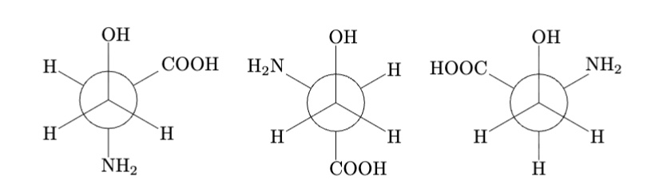
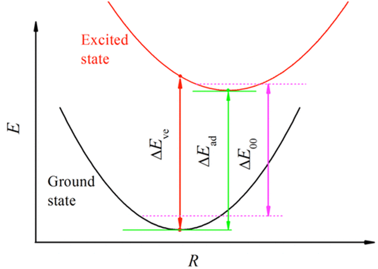

# Tutorial 2 – 2D materials  .....TO BE CONTINUE ...


### **Learning Objectives**
- Visualising,comparing and Stability-ranking of conformers. 
- Vertical vs adiabatic IP & EA, and how to compute them. 

---

## EX1: Conformers

### **What are conformers?**

* Molecules with the **same formula** and **same bonds**,
* But **different 3D orientations** due to **rotation around single bonds**.
* Not mirror images.
👉 Conformers = same molecule, different shapes from bond rotation.

---

### **How do we describe conformers?**



**Figure 1:** serine



**Figure 2:** Newmann Projections of serine conformers.

* Use a **dihedral angle**: the rotation angle between two groups across a bond.
* Example: in **serine**, we can look down a C–C bond and measure how the **–COOH group** rotates relative to the **–OH group** at 0°,as shown in the above Newman Projections.
* Different dihedral angles = different conformers.
---

### **Energy and dihedral angles**

* As you rotate a molecule, the **energy changes**.
* Here is an Example plotting energy vs. dihedral angle gives the **conformational energy profile** of  **Butane** :
* Multiple **local minima** (stable conformers).
* One **global minimum** (most stable).


**Figure 3:** Energy vs. dihedral angle of butane.


* Conformers can get **trapped in local minima**, so computational methods may not always find the **global minimum**. For molecules like serine, the global minimum is not obvious — it must be **calculated and compared**.

---

### **Follow the steps**
- Make a folder for each [serine conformers](https://aminoacidsguide.com/Ser.html) (named by different dihedral angle. `60.in`,`180.in`,`300.in`) and rename each `.in` files to `geometry.in`. Try to prepare `control.in` by reading from `geometry.in` this time by `write_control.py`:

  ```bash
  python /home/27735A_group/shared/example/write_control.py \
  --input_geometry --species_default light 
  ```
  then add this line for non-periodic relaxation:
  ```text
  relax_geometry bfgs 1e-2
  ```
- Then copy `submit.sh` to each folders, submit the jobs and grep the energy after DFT calculations finished, same as Section 1.


### **Assignment 3**: Relative Energies of Serine Conformers (20 Points)


* (10 Points) Compute **ΔE = E – E<sub>min</sub>**. Usually we want to convert eV (in DFT results) to KJ/mol by timing the factor 96.485. Plot ΔE vs dihedral angle → identify global minimum among local minimums.
* (10 Points) Compare the **relative energies of conformers** after relaxation you obtained with:
  * Local Density Approximation (**LDA**)
  * **[DFT with hybrid functional B3LYP](https://www.researchgate.net/publication/231638970_Conformational_behavior_of_serine_An_experimental_matrix-isolation_FT-IR_and_theoretical_DFTB3LYP6-31G_study?utm_source=chatgpt.com)**. (click to access to papers)
  * **[CCSD(T)](https://pubmed.ncbi.nlm.nih.gov/27294314/)** results.
* Draw conclusions from the comparison.
---


## EX2:  Compute IP & EA of fumaronitrile.


Here is the structure of **fumaronitrile**: 


**Figure 4: fumaronitrile**

###  **IP & EA**
- IP(Ionization Potential):  Energy required to remove 1 e⁻, E<sub>N-1</sub> − E<sub>N</sub>

- EA(Electron Affinity) : Energy released / required to add 1 e⁻, E<sub>N</sub> − E<sub>N+1</sub>


### **Vertical & Adiabatic**
- Vertical (V): Energy difference between the excited state and the ground state while the geometry is held constant.
- Adiabatic (A): Energy difference between the excited state after post-excitation relaxation and the ground state. 




[**Figure5**](https://pubs.acs.org/doi/10.1021/jp501974p): Vertical (∆E_ve) versus adiabatic (∆E_ad) energies. 


### **Follow the steps**

- **Relax neutral molecule, get E(0) and prepare geometry.in**

    Rename `fumaronitrile.in` to `geometry.in`, try to relax it, you already know how to do that! Start from the relaxed neutral structure for the following calculation, add the line `initial_moment 1` to the beginning of the `geometry.in.next_step` file, then copy it under the "vertical/adiabatic" dir by(for example) :
    ```bash
    cp geometry.in.next_step ./IP/adiabatic/geometry.in
    ```
- **Adiabatic & Vertical (IP)**

    Create `control.in` file. Key edits in `control.in` (adiabatic):

    ```
    spin             collinear
    charge           +1.
    fixed_spin_moment 1
    relax_geometry bfgs 1e-2
    ```
    Delete `relax_geometry` for **vertical** calculation.

- **EA is analogous (charge –1).**

- **Extract & compute**

    Compute each single point energy of each runs, grep E(+1) and E(–1), compute ΔE_ip and ΔE_ea.
    ```
    ΔE_ip  = E(+1) – E(0)
    ΔE_ea  = E(0) – E(–1)
    ```
---

### **Assignment 4**: Ionization Potential (IP) and Electron Affinity (EA) of Fumaronitrile (20 Points)

* Compare the results of **IP and EA of fumaronitrile** you obtained using LDA with the  **[Experimental values](https://webbook.nist.gov/cgi/cbook.cgi?ID=C764421&Mask=107F&utm_source=chatgpt.com)** and **[CCSD(T) reference values](https://pubs.acs.org/doi/10.1021/acs.jctc.5b00875)**
  * **Note**: all computed values reported in these papers are **vertical values**.
  * Draw conclusions from the comparison.


  
---

### **Assignment 5**: Energy Scales in DFT (20 points)

You need to compare **three different types of energies** that appear in electronic structure calculations:

- **Total energy (DFT ground-state energy)**.
- **Electronic excitations (IPs and EAs)**.
- **Relative energies of conformers**.
Then you discuss:
* Is the **total energy itself meaningful**?
* What do these different energy scales imply about **how accurate DFT (or any electronic structure method) must be**?
