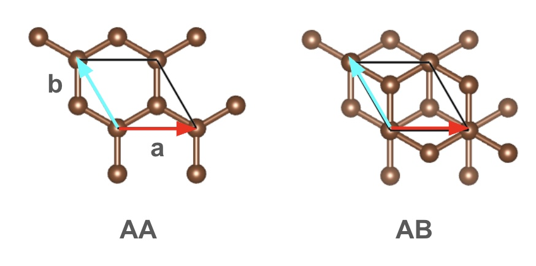
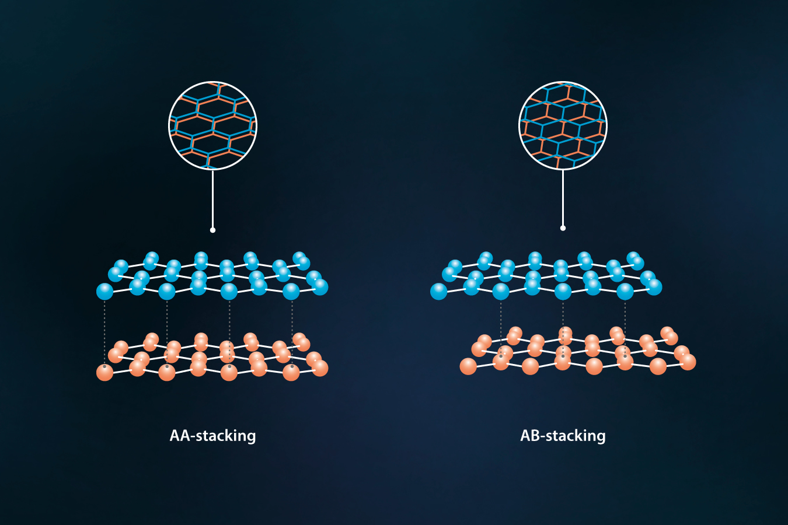
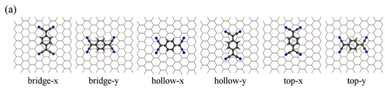

# Tutorial 3 – 2D Materials and Surfaces

### 📘**Introduction** 

Van der Waals (vdW) interactions play a crucial role in layered materials and surface adsorption phenomena. Unlike the covalent and ionic bonding within atomic layers, weak vdW forces govern interlayer binding in materials such as graphene, hexagonal boron nitride (hBN), and transition metal dichalcogenides. These weak interactions are challenging for standard DFT functionals to capture accurately, necessitating specialized dispersion corrections.

In this tutorial, we will explore:

* **Van der Waals corrections in DFT** and their implementation for layered and surface systems
* **Surface slab models** with proper vacuum spacing and convergence testing
* **Bilayer stacking configurations** and their effects on binding energies and electronic structure
* **Molecule-on-surface adsorption** including site preferences and energetics
* **Comparison of different dispersion correction** (PBE, PBE+TS, PBE+MBD) for vdW systems

---

### 🎯**Learning Objectives**

By the end of this tutorial, you will be able to:

* Understand the importance of van der Waals corrections in DFT and distinguish between different correction methods (PBE+TS, PBE+MBD)
* Construct surface slab models with appropriate vacuum regions and convergence criteria
* Perform systematic convergence tests for k-points and vacuum spacing
* Analyze the effects of stacking order on binding energies and electronic properties of bilayer systems
* Set up and evaluate molecule-on-surface systems with proper treatment of dispersion interactions
* Compare computational efficiency versus accuracy trade-offs for different vdW-corrected functionals

---

> **Please Note**
> - Distances are in Å
> - Always copy the Tutorials to your working directory first from `/home/27735A_group/shared/example`, where you can find the files needed for the assignments.
> - The arguments or discussion in all you assignments should be supported by **data**, **tables** or preferably **graphs**.
> - Activate your virtual env if the python script needs ase.
> - **All input/output files and scripts used for the performance of hands-on assignments and the final project should be placed in an organized directory and available for review. A README file explaining what all the files are should be placed in the directory.**


## Preparation
- **Log in to Arjuna**
  ```bash
  ssh <AndrewID>@arjuna-local.lan.local.cmu.edu
  ```
- **Enter your working directory**
  ```bash
  cd /home/27735A_group/<AndrewID>
  ```
  - You are at the working directory now, type `pwd` to get your current path. 
  - Any computations should be finished under this folder, not your home path.
  
- **Activate your virtual env**
  ```bash
  module load miniconda3-4.9.2-gcc-11.2.0-et7ujxr
  conda activate ase_env
  ```
- **Activate your `aims_env`**
  ```bash
  source /home/27735A_group/shared/bin/aims_env.sh
  ```
- **Prepare the Tutorial files**
  ```bash
  cp -r /home/27735A_group/shared/example/Tutorial_3 .
  ```
- **Enter folder and run bash script**
  ```bash
  cd Tutorial_3
  bash dir_tree.sh
  ```
---

## EX1  Bilayer Graphene – van der Waals Interactions

### **1.1 Understanding van der Waals Corrections**

Graphene is a single-layer two-dimensional material consisting of carbon atoms arranged in a hexagonal lattice. When multiple graphene layers stack together, they interact through weak van der Waals (vdW) forces rather than covalent bonds. Standard DFT functionals like PBE struggle to capture these weak, long-range dispersion interactions, often predicting no binding or incorrect interlayer distances.


### **1.2 Build the bilayer graphene structure**

[Graphene](https://en.wikipedia.org/wiki/Graphene) has a hexagonal lattice structure with a lattice constant of approximately 2.46 Å. For bilayer graphene, we need to create two layers separated by the typical interlayer distance and add sufficient vacuum to prevent spurious interactions between periodic images.


**Enter the k-point convergence folder:**
```bash
cd ./bilayer_graphene/convergence/k_grid
```

**Manual construction**

If you'd like to manually build the bilayer graphene structure (AA stacking), use the lattice shown in Figure 1. Follow these steps to write your `geometry.in` by hand:

**Figure 1:** Schematic of hexagonal graphene lattice used to build AA/AB stacking.

     
1. **Set lattice vectors for graphene:**
   - Graphene has a hexagonal lattice with lattice constant *a* ≈ 2.46 Å.
   - The in-plane lattice vectors are:
     ```
     lattice_vector   2.46000000   0.00000000   0.00000000
     lattice_vector   -1.23000000   2.13000000   0.00000000
     ```
     (where 2.13 Å = 2.46 × √3 / 2 and -1.23 Å = -2.46 / 2)

2. **Add the out-of-plane lattice vector (z direction):**
   - The starting point of interlayer spacing is 3.3 Å; add a vacuum layer to avoid spurious interactions along *z*. Use, for example, 20 Å vacuum:
     ```
     lattice_vector    0.00000000    0.00000000   23.30000000
     ```
     (Total cell height = 3.3 Å + 20.0 Å = 23.3 Å)

3. **Place atomic positions (AA stacking, using coordinates from `hex.jpg`):**
   - In the primitive cell, graphene has atoms at (0, 0) and (-1/3, -2/3) in fractional coordinates, please check this [web](https://lampz.tugraz.at/~hadley/ams_ss/problems/3_crystal_structures/graphene.php) for reference. For AA stacking, the upper layer is positioned directly above the lower-layer atoms in x-y, only shifted in *z*.
   - Bottom layer (z = 0.0):
     ```
     atom_frac  0.00000000  0.00000000  0.00000000  C
     atom_frac  -0.33333333  -0.66666667  0.00000000  C
     ```
   - Top layer (z = interlayer distance as a fraction of total cell height; with interlayer_distance = 3.3 Å, total cell height = 23.3 Å; z2 = 3.3/23.3 ≈ 0.142):
     ```
     atom_frac  0.00000000  0.00000000  0.142  C
     atom_frac  -0.33333333  -0.66666667  0.142  C
     ```

4. **Combine all into your `geometry.in` file:**
   ```
   # Bilayer graphene (AA stacking; manual positions from hex.jpg)
   lattice_vector   2.46000000   0.00000000   0.00000000
   lattice_vector   -1.23000000   2.13000000   0.00000000
   lattice_vector   0.00000000   0.00000000  23.30000000

   atom_frac  0.00000000  0.00000000  0.00000000  C
   atom_frac  -0.33333333  -0.66666667  0.00000000  C
   atom_frac  0.00000000  0.00000000  0.142     C
   atom_frac  -0.33333333  -0.66666667  0.142     C
   ```

*Note: The z component of the third lattice vector MUST include both interlayer spacing (3.3 Å) and vacuum (e.g., 20 Å) to avoid slab-slab interactions in the simulation! Increase vacuum if needed for convergence studies.*

**Alternative: Build using ASE:**

Use the provided `Surfaces.py` utility to construct the bilayer graphene structure:

```bash
# Build AA stacking
python /home/27735A_group/shared/example/Surfaces.py --build_bilayer --stacking AA --interlayer_distance 3.3 --vacuum 20.0
```

**Visual-check in OVITO:**
- Verify the structure has 4 carbon atoms (2 per layer)
- Check the interlayer distance is ~3.3 Å
- Ensure adequate vacuum spacing

### **1.3 K-point convergence test for 2D systems**

**Why is k-point convergence different for 2D materials?**

For 2D layered systems like graphene, the periodicity only exists in the x-y plane, while the z-direction has vacuum. Therefore:
- **k-points in x and y** must be well-converged.
- **k-points in z** should be minimal, since there's no periodicity in that direction.

The k-point sampling directly affects the quality of Brillouin zone integration and thus the total energy, band structure, and other properties.

**Create the `control.in`:**

```bash
python /home/27735A_group/shared/example/write_control.py --elements C
```

The control.in should contain:
```text
xc            pbe           
many_body_dispersion         # start with MBD correction
spin          none           # Non-magnetic
relativistic  none
charge        0.
k_grid        n n 1          # Test n = 6, 8, 10, 12, 14, 16..
use_dipole_correction                         .true.
compensate_multipole_errors                   .true.
```

**Important:** For 2D systems, use `k_grid n n 1` format (same grid in x,y; single point in z).

**Run convergence test:**

Test k-grid densities from 4×4×1 to 16×16×1. For each k-grid:
1. Create a separate directory (e.g.,`k_6x6x1`, etc.)
2. Copy `geometry.in` and modify `control.in` with the specific k-grid
3. Copy `submit.sh` and submit the job
   ```bash
   cp /home/27735A_group/shared/example/submit.sh .
   ```
4. After completion, extract the total energy from `aims.out`

**Automated approach:**

Use `Surfaces.py` for automatic setup and submission:
```bash
python /home/27735A_group/shared/example/Surfaces.py --make_k_grid_2d --k_grid_min 6 --k_grid_max 22 --k_grid_step 2
```

After jobs finish, plot the convergence:
```bash
python /home/27735A_group/shared/example/Surfaces.py --plot_k_grid_2d
```

**Expected behavior:**
Plot total energy E vs. k-grid density n. Look for where the energy curve flattens. Choose the smallest n where convergence is achieved.


### **1.4 Vacuum convergence test**

**Why do we need vacuum convergence?**

In slab calculations, we model 2D materials by placing them in a 3D periodic supercell with vacuum space in the z-direction. This vacuum prevents spurious interactions between the slab and its periodic images in neighboring cells. 

We need to find the **minimum vacuum thickness** that ensures:
- No interaction between periodic images (energy converged)
- Efficient use of computational resources

**Enter the vacuum convergence folder:**
```bash
cd ../vacuum
```

**Prepare structures with different vacuum spacings:**

For each vacuum thickness (e.g., 10, 15, 20, 25, 30 ....Å), you need to create a separate `geometry.in` with the same bilayer structure but different total z-lattice vector.

**Run convergence test:**

For each vacuum spacing:
1. Create a directory (e.g., `vac_10`, `vac_15`, etc.)
2. Copy the corresponding `geometry.in`
3. Copy `control.in` with **converged k-grid from Assignment 1**
4. Copy `submit.sh` and submit the job
   ```bash
   cp /home/27735A_group/shared/example/submit.sh .
   ```
5. Extract total energy from `aims.out`

**Important:** Use the **same converged k-grid** from Assignment 1 for all vacuum tests to isolate the effect of vacuum spacing.


**Automated approach:**

Copy the `submit.sh` and the `control.in` with converged k grid.  Use `Surfaces.py` to generate and submit structures with different vacuum spacings:

```bash
python /home/27735A_group/shared/example/Surfaces.py --vacuum_series --interlayer_distance 3.30 --stacking AA
```

After running calculations for all vacuum spacings:
```bash
python /home/27735A_group/shared/example/Surfaces.py --plot_vacuum
```

This will automatically collect energies from all `vac_*` directories and generate a convergence plot. Choose the smallest vacuum where energy changes become negligible.

---

### **Assignment 1** Bilayer Graphene k-Point and Vacuum Convergence (10 points)

* **(2 points)** First, construct a bilayer graphene structure with AA stacking and an initial interlayer separation of 3.30 Å. Set the initial vacuum spacing in the z-direction to 20 Å. Prepare the `geometry.in` file and visually inspect the structure to ensure correctness.

* **(5 points)** Next, perform a k-point convergence test by varying the k-grid from 6×6×1 up to 22×22×1 (or until you reach convergence),with step 2. For each k-grid, keep the vacuum spacing fixed at 20 Å and use the PBE functional without vdW corrections. Record k-grid settings and corresponding total energies in a table, and plot both E(n) and |dE/dn| as a function of k-grid density n. Determine the converged k-grid.

* **(3 points)** Using the converged k-grid, perform vacuum convergence tests by varying the vacuum spacing from 10 Å to 50 Å (suggested: 10, 15, 20, 25, 30... Å). For each vacuum size, maintain the same interlayer distance (3.30 Å) and only change the total z-component of the unit cell. Plot total energy E versus vacuum thickness. Choose the converged vacuum thickness.
---

### **1.5 Stacking configurations in bilayer graphene**

**What is stacking and why does it matter?**

When two graphene layers come together, the relative lateral positioning of atoms determines the stacking configuration. Different stackings lead to different properties.


**Common stacking configurations:**

- **AA Stacking**: All carbon atoms in the top layer are directly above atoms in the bottom layer. This is a high-symmetry configuration but energetically unfavorable due to strong repulsion between overlapping π-orbitals.

- **AB (Bernal) Stacking**: Half of the carbon atoms in the top layer sit above the centers of hexagons in the bottom layer. This is the natural stacking found in graphite and is energetically most stable. The reduced orbital overlap allows favorable van der Waals attraction.

**Figure 2: Common stacking arrangements of bilayer graphene (AA and AB configurations)**


     
**Build stacking configurations:**

```bash
cd ../stacking/AA #(or AB)
```

Use `Surfaces.py` to build different stacking configurations:

```bash
# Build AA stacking
python /home/27735A_group/shared/example/Surfaces.py --build_bilayer --stacking AA --interlayer_distance 3.30 --vacuum <optimal>

# Build AB (Bernal) stacking  
python /home/27735A_group/shared/example/Surfaces.py --build_bilayer --stacking AB --interlayer_distance 3.30 --vacuum <optimal>
```


**Visual verification:**
- Load both structures in OVITO
- For AA: all atoms should be vertically aligned
- For AB: top layer atoms should sit over hexagon centers in bottom layer

---

### **1.6 Binding energy calculations**


**What is binding energy?**

**Binding Energy in Bilayer Graphene**

The binding energy measures the strength of the interaction between two graphene layers. It is calculated as:

E_binding = E_bilayer - 2 * E_monolayer

**Where:**
- **E_bilayer:** Total energy of the relaxed bilayer graphene system (4 carbon atoms)
- **E_monolayer**: Total energy of an isolated single-layer graphene sheet (2 carbon atoms)

This value tells you how strongly the two layers interact: the more negative E_binding, the stronger the binding between the layers. Minimum on curve corresponding to the equilibrium interlayer distance.

Now we test how different functionals perform for vdW interactions. For the both stackings at multiple interlayer distances, run calculations with each functional.

**Common vdW Correction Methods:**

- **PBE (no correction)**: Standard GGA functional without dispersion. Often fails to bind layered systems correctly.
  ```text
  xc pbe
  ```

- **[PBE+TS (Tkatchenko-Scheffler)](https://manual.q-chem.com/5.2/Ch5.S7.SS4.html)**: Pairwise C₆/R⁶ correction with environment-dependent parameters. Good balance of accuracy and speed.
  ```text
  xc pbe
  vdw_correction_hirshfeld
  ```

- **[PBE+MBD (Many-Body Dispersion)](https://manual.q-chem.com/5.2/Ch5.S7.SS5.html)**: Includes collective many-body effects beyond pairwise interactions. More accurate but computationally expensive.
  ```text
  xc pbe
  many_body_dispersion
  ```

**Workflow for binding energy curves:**

**Step 1: Calculate monolayer reference**

First, we need the energy of an isolated graphene monolayer:

```bash
cd ../distance_scan/pbe/monolayer
```

Create a single-layer graphene structure with the same vacuum and k-grid:

```python
from ase.build import graphene
from ase.io import write

# Single layer with same vacuum as bilayer
layer = graphene(vacuum=0)
layer.center(vacuum=<optimal>/2, axis=2)
write("geometry.in", layer, format='aims')
```

Copy `control.in` by `cp ../../../kpts/control.in .` , use  your converged k-grid and test among different functionals (PBE, PBE+TS, PBE+MBD).

**Step 2: Scan interlayer distances for bilayer**

For each stacking (AA and AB), create structures with different interlayer distances:

Suggested distances: **from 3.0 to 4.5 Å with a step 0.1 Å**

```bash
cd ..
cp /home/27735A_group/shared/example/submit.sh .
cp monolayer/control.in .
```

Generate all structures automatically:

```bash
# Use Surfaces.py command line
python /home/27735A_group/shared/example/Surfaces.py --distance_scan --stacking AA --vacuum <optimal> 

```

**Step 3: Calculate and plot binding energies**

After all calculations finish, use `Surfaces.py` to analyze:

```bash
# Use Surfaces.py command line
python /home/27735A_group/shared/example/Surfaces.py --plot_binding_curve 
```

Once you have identified the optimal region, perform a high-resolution scan as follows:
```bash
# Run Surfaces.py to refine the interlayer distance scan
python /home/27735A_group/shared/example/Surfaces.py --distance_scan --stacking AA --vacuum <optimal> --distance_min <min> --distance_max <max> --distance_step 0.01
```


Choose the best stacking with optimal distance of each functional. Then answer the following question:

**Analysis points:**
- Which stacking is most stable?
- What is the equilibrium distance for each functional?
- How do results compare to the DMC(diffusion quantum Monte Carlo) result in Figure 3 of this [paper](https://journals.aps.org/prl/abstract/10.1103/PhysRevLett.115.115501)?
- Which functional gives the most close distance with the DMC result according to the Table 1 in the paper? 
---

### **1.7 Band Structure and Density of States (DOS)**

Before setting up the band structure and DOS calculations, let us choose the structure that is optimal in 1.6  as `geometry.in` for the following calculation:

```bash
cd ../band 
```

Use the geometry with the equilibrium interlayer distance obtained from your binding energy curves.

Add the following to your `control.in` file:

```text
xc            pbe
many_body_dispersion
# Use the optimal functional.
k_grid        n n 1 # converged k_grid
use_dipole_correction                         .true.
compensate_multipole_errors                   .true.
relativistic       atomic_zora scalar

# Band structure for 2D hexagonal system
# High-symmetry path: Gamma - M - K - Gamma 
output band  0.0   0.0   0.0  0.5   0.0   0.0  59   Gamma M
output band  0.5   0.0   0.0  0.33333  0.33333  0.0    34  M K
output band  0.33333  0.33333  0.0  0.0  0.0  0.0  68   K Gamma
output dos                        -20 10 3001 0.1
```

**High-symmetry points for hexagonal 2D systems:**

| Point | k_x     | k_y     | k_z |
|-------|---------|---------|-----|
| Γ     | 0.0     | 0.0     | 0.0 |
| M     | 0.5     | 0.0     | 0.0 |
| K     | 0.33333 | 0.33333 | 0.0 |

Run the calculation:
```bash
cp /home/27735A_group/shared/example/submit.sh .
sbatch submit.sh
```

**Plotting Results:**

To analyze your electronic structure, plot both the band structure **and** density of states:

```bash
python /home/27735A_group/shared/example/Tutorial_2/aimsplot.py
```
Or you could import the ./band folder to [GIMS](https://gims.ms1p.org/static/index.html#BandStructure-workflow#StructureBuilder)

---

### **Assignment 2** Stacking, Functionals, and Binding Energy Analysis (30 points)

* **(20 points)** For both **AB and AA stacking**, visualize the stackings and provide the screenshots. Scan interlayer distances from 3.0 Å to 4.5 Å ,with a step 0.1 Å. Compare and find the best  stacking,Then do fine-grid search for that stacking at the lowest energy region at step 0.01 Å.(for example, from 3.3 Å to 3.4 Å at 0.01 Å). For each distance, perform single-point calculations using **all three functionals** (PBE, PBE+TS, PBE+MBD). Plot binding energy curves (E_binding vs. distance) for all combinations. Clearly label each curve and mark equilibrium points. From your plots, extract and tabulate the equilibrium interlayer distance and binding energy for each functional. Compared with the[literature](https://journals.aps.org/prl/abstract/10.1103/PhysRevLett.115.115501).
* **(10 points)** Discuss which functional is most accurate, which stacking is more stable (lower energy at equilibrium)? What is the energy difference between the two stackings? And why is that? 

### **Assignment 3** Bilayer Graphene Electronic Structure Analysis (20 points)

* **(10 points)** Use the best functional and best stacking to relax the structures at their respective equilibrium distances. Then calculate and plot the band structures and DOS for that setting. Relate your observations to the electronic and density of states properties of bilayer graphene. 
* **(10 points)** Compare with the band structure in [literature](https://www.sciencedirect.com/science/article/pii/S2352492824019135). What are the features of the bandstructure? why is that happen?

---

## EX2  TCNQ Adsorption on Graphene Surfaces

### **2.1 Introduction to TCNQ-Graphene Interactions**

TCNQ (tetracyanoquinodimethane) is a strong electron acceptor molecule that forms interesting charge transfer complexes with graphene. When TCNQ adsorbs on graphene, several important interactions occur:

- **Van der Waals interactions**: TCNQ is a large aromatic molecule that interacts primarily through dispersion forces
- **Charge transfer**: TCNQ can accept electrons from graphene, leading to p-type doping
- **π-π stacking**: The aromatic rings of TCNQ can stack with graphene's π-system
- **Site-dependent binding**: Different adsorption sites (top, bridge, hollow) have different binding strengths

**Key concepts:**

**Definition of Adsorption Energy:**

The adsorption energy quantifies how strongly TCNQ binds to graphene. It is calculated as:

E_ads = E_system - (E_slab + E_molecule)

where:
- E_system: total energy of the combined TCNQ-on-graphene system
- E_slab: total energy of the clean graphene slab
- E_molecule: total energy of the isolated TCNQ molecule

**Interpretation:**
- If E_ads < 0: Adsorption is exothermic, indicating that TCNQ is stably bound to graphene
- If E_ads > 0: Adsorption is endothermic, meaning there is no favorable binding

**TCNQ Structure:**
- Formula: C₁₂H₄N₄ (tetracyanoquinodimethane)
- Planar aromatic molecule with 4 cyano groups
- Strong electron acceptor properties
- Size: ~8 Å × 4 Å (approximate dimensions)

**Adsorption sites on graphene:**

- **Top site**: Directly above a carbon atom (1-fold coordination)
- **Bridge site**: Between two carbon atoms (2-fold coordination)  
- **Hollow site**: Above the center of a hexagonal ring (3-fold coordination)

**Figure 3: TCNQ Adsorption Sites on Graphene**


The figure shows the 6 possible TCNQ adsorption configurations on graphene, including both site types (top, bridge, hollow) and orientations (x, y). Each configuration represents a different initial placement for convergence testing and adsorption energy calculations.

---

### **2.2 Build the Structure, Place the Molecule, and Generate `control.in`**

To investigate TCNQ adsorption, follow these steps in order:

#### **Step 1: Build the Graphene Slab**

Navigate to the convergence folder:
```bash
cd ../../../../tcnq_adsorption/convergence
```

Create a single-layer graphene slab with vacuum:
```bash
python /home/27735A_group/shared/example/Surfaces.py --build_graphene_slab --layers 1 --size 7 7 --vacuum 20.0
```
- `--layers 1`: single graphene sheet  
- `--size 7 7`: 7×7 supercell (increase as needed)
- `--vacuum 20.0`: vacuum gap in Å

(Optional) Visualize in OVITO to check the slab.

#### **Step 2: Place TCNQ on the Graphene Slab**

Place the TCNQ molecule on graphene:
```bash
# Example: Place TCNQ at hollow site, x-orientation, 3.5 Å above graphene
python /home/27735A_group/shared/example/Surfaces.py --place_tcnq_on_graphene --tcnq_site hollow --tcnq_orientation x --tcnq_height 3.5 --vacuum 20.0
```
- Use `--tcnq_site` (`top`, `bridge`, or `hollow`)
- Use `--tcnq_orientation` (`x` or `y`)
- Adjust `--tcnq_height` as needed

Rememeber to rename the file generated to `geometry.in` file for DFT calculation.

#### **Step 3: Generate and Edit `control.in`**

Generate `control.in` after you have the final `geometry.in`:
```bash
cp geometry_tcnq_hollow_x.in geometry.in
python /home/27735A_group/shared/example/write_control.py --input_geometry
cp /home/27735A_group/shared/example/submit.sh .
```

Edit `control.in` to set the calculation parameters you require. Example minimal settings:
  ```bash
  xc            pbe
  vdw_correction_hirshfeld  # PBE+TS
  spin          none
  relativistic  none  
  charge        0.
  k_grid        4 4 1  # Adjust after convergence
  use_dipole_correction                         .true.
  compensate_multipole_errors                   .true.
  ```
Adjust these parameters according to your convergence tests and the requirements of your adsorption study.

Once you have set these options in `control.in`, proceed to copy `submit.sh` and run calculations as usual.


---

### **2.3 Convergence Testing for TCNQ on Graphene**

For TCNQ adsorption on single-layer graphene, we need to systematically converge two key parameters: **vacuum spacing** and **k-point grid**. Since we're working with a single graphene layer, there's no slab thickness to converge.

**Convergence Protocol:**
```
1. Vacuum convergence (with reasonable k-points)
2. k-point convergence (with converged vacuum)
3. Only then proceed to property calculations using fully converged parameters
```

#### **Step 1: Vacuum Convergence (with reasonable k-points)**

*Why start with vacuum?*  
- Vacuum spacing prevents interactions between periodic images of the graphene sheet
- Use reasonable initial k-grid (4×4×1) for efficiency
- Goal: Find the minimum vacuum where **adsorption energy** is converged

**Test different vacuum spacings** (e.g., 10, 15, 20, 25, 30, 35, 40 Å):

  - Enter the `tcnq_adsorption/convergence/vacuum` folder, make subfolders for each vacuum spacing, copy `control.in` and `submit.sh` to run the calculation.
  ```bash
  cp ../geometry_graphene.in .
  python /home/27735A_group/shared/example/Surfaces.py --vacuum_series --EX_step 2
  ```
  - After running calculations for all vacuum spacings:
  ```bash
  python /home/27735A_group/shared/example/Surfaces.py --plot_vacuum
  ```


4. **Plot E_ads vs. vacuum spacing** and choose converged vacuum.

---

#### **Step 2: k-Point Grid Convergence (with converged vacuum)**


**Procedure:**
1. **Fix vacuum** to converged value from Step 1
   Copy the `geometry.in` with the optimal vacuum to the `k_grid` folder, as well as `control.in` and `submit.sh`.
2. **Test different k-point grids** (e.g., 2×2×1, 3×3×1, 4×4×1):
   ```bash
   python /home/27735A_group/shared/example/Surfaces.py --make_k_grid_2d --k_grid_min 2 --k_grid_max 5 --k_grid_step 1
   ```

3. **For each k-grid**, calculate E_ads using the same procedure
4. **Plot E_ads vs. k-grid** and choose 
converged k-grid

  ```bash
  python /home/27735A_group/shared/example/Surfaces.py --plot_k_grid_2d
  ```

Plot total energy E vs. k-grid density n. Look for where the energy curve flattens. Choose the smallest n where convergence is achieved.
---


### **2.4 Building and Placing Molecules on Surfaces**

#### **1. Build the molecule structure and graphene slab:**
```bash
python /home/27735A_group/shared/example/Surfaces.py --build_molecule --molecule tcnq
python /home/27735A_group/shared/example/Surfaces.py --build_graphene_slab --layers 1 --size 4 4 --vacuum <optimal>

```

#### **2. Place TCNQ on graphene at specific adsorption sites**

Use the new TCNQ-specific functions:

```bash
# Place TCNQ at specific site and orientation 
python /home/27735A_group/shared/example/Surfaces.py --place_tcnq_on_graphene --tcnq_site hollow --tcnq_orientation x --tcnq_height 3.5 --vacuum <optimal>

# Or you could automatically create all 6 adsorption configurations by this command:
python /home/27735A_group/shared/example/Surfaces.py --create_tcnq_adsorption_series --vacuum <optimal>
```

**Available configurations:**
- **Sites**: top, bridge, hollow
- **Orientations**: x, y
- **Total**: 6 configurations (top-x, top-y, bridge-x, bridge-y, hollow-x, hollow-y)

**Tips:**
- Visually inspect results (e.g., in OVITO) to verify correct placement
- Use height 3.5 Å for initial placement
- All configurations are automatically generated with proper naming

---


### **2.5 Calculating adsorption energies**

**Step 1: Calculate reference energies**

**Isolated TCNQ molecule in a box:**
```bash
cd ../PBE_TS/molecule_ref
# Copy tcnq.in as geometry.in
# no k_grid for molecule.
# Calculate E_molecule
```

**Clean graphene slab (no molecule):**
```bash
cd ../slab_ref
# Use the graphene slab geometry
# Same functional and k-grid as final calculations
# Calculate E_slab
```

**Step 2: Calculate combined system**

For each adsorption site, use PBE+TS functional:
```bash
cd ../adsorption_sites/topx
# Copy geometry_mol_on_slab_top.in
# Run calculation
```

**Step 3: Extract and analyze**
Calculate the adsorption energy:
E_ads = E_total- (E_slab+E_mol)
 and compare among different adsorption sites.


### **2.6 Height-dependent adsorption/binding energy: scan and curve**

The adsorption (binding) energy depends on the vertical distance (height) between TCNQ and the graphene surface. For each of the 6 adsorption configurations shown in Figure 3, systematically vary the TCNQ height above the graphene (e.g., from 2.8 Å to 3.6 Å in 0.1 Å increments).

For each height:
1. Place TCNQ at the chosen adsorption site and height above the graphene (keeping x/y position fixed).
2. Run a single-point calculation to obtain the total energy.

You can use the automated functions in `Surfaces.py` to perform this scan and plot the adsorption curve. The relevant command is:

```bash
cp ../geometry_graphene.in .
python /home/27735A_group/shared/example/Surfaces.py --create_height_scan --tcnq_site <site> --tcnq_orientation <x|y>  --height_min 2.8 --height_max 3.6 --height_step 0.1 --vacuum <optimal>
```

This command will:
- Systematically generate structures with the requested site, orientation, and height range
- Prepare directories, geometry files, and input files for each height
- Optionally submit calculations (if configured)
- After calculations finish, plot the adsorption energy as a function of TCNQ height

To plot the resulting adsorption energy curve after calculations, use:

```bash
python /home/27735A_group/shared/example/Surfaces.py --plot_height_scan --tcnq_site <site> --tcnq_orientation <x|y> --E_slab <e> --E_molecule <e>
```

Replace `<site>` with one of `top`, `bridge`, or `hollow`; `<x|y>` with the desired orientation.

These tools automate both preparation and analysis of the height-dependent adsorption curves for all configurations.


### **2.7 Comparing van der Waals functionals for adsorption**

Just like with bilayer graphene, different functionals predict different adsorption strengths.

**Test all three functionals for the most favorable site:**

For each functional (PBE, PBE+TS, PBE+MBD):
1. Use the same geometry (e.g., hollow site)
2. Change only the vdW correction in `control.in`
3. Run single-point calculation
4. Calculate adsorption energy


---

### **Assignment 4** Graphene Slab and TCNQ Adsorption (20 points)

**Task:** Select system: TCNQ on graphene.

- (5 points) Perform convergence test. Determine minimum converged vacuum and k_grid.
- (10 points) For each of 6 adsorption configurations, vary the height of molecules over graphene. Plot the adsorption energy curve as a function of TCNQ–graphene distance for dispersion correction methods (PBE,PBE_TS,PBE_MBD). From the curve, identify the optimal binding height (minimum energy), equilibrium adsorption energy, and compare how the energy curve changes for different configurations and heights. Compare between different dispersion correction methods.
- (5 points) Compare the optimal adsorption configurations, equilibrium distances and adsorption energy you get with the result in [literature](https://www.sciencedirect.com/science/article/pii/S0008622316308831). (Note: Compare the PBE_vdW result in paper with PBE_TS result you obtained.)
---

### **Assignment 5** Dispersion Correction and Adsorption Site (20 points)

For the optimal adsorption sites from Assignment 4:

- (10 points) Compare the computational cost (time) between different dispersion correction methods. Discussion of computational cost vs. accuracy trade-offs. Analysis of how vdW corrections affect adsorption energetics. 
- (10 points) Compare the converged k-point grids (K_grid) used in EX1 and EX2. Why are the required k-point samplings so different? Discuss the physical reasons behind the variation in k-point convergence between these two scenarios.

---
