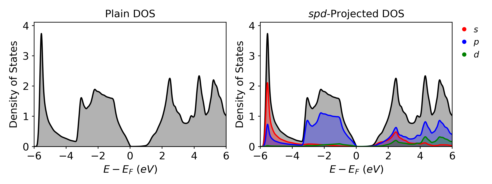
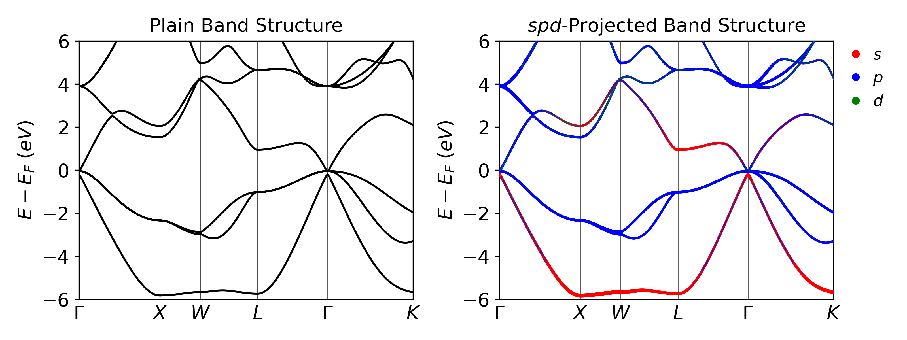

# Bulk InAs (PBE)
In this step we will run our first calculation on bulk InAs

## Recommended Folder Layout
- `basic_training`
	- `InAs_bulk`
		- `pbe`
			- `scf`
			- `band`
			- `dos`

## Basic Steps
1. Run the SCF Calculations in the `scf` folder.
2. Copy the CHG and CHGCAR files to the `band` and `dos` folders.
3. Run the Band and DOS calculations.
4. Plot the data.

## Global Files
The POSCAR and POTCAR will be the same for the SCF, DOS, and Band calculations.

### POSCAR
The POSCAR for the bulk InAs is given below

```txt
In1 As1  
1.0  
0.000000 3.029200 3.029200  
3.029200 0.000000 3.029200  
3.029200 3.029200 0.000000  
In As  
1 1  
direct  
0.000000 0.000000 0.000000 In  
0.250000 0.250000 0.250000 As
```

### POTCAR
The POTCAR can be easily generated using the potcar.sh script included in the basic training files.

```bash
potcar.sh In As
```

To double check the elements in the POTCAR you can run the following command

```bash
grep 'TITEL' POTCAR
```

The output will be the following

```txt
   TITEL  = PAW_PBE In 08Apr2002
   TITEL  = PAW_PBE As 22Sep2009
```

## Generating these inputs with VASPKIT

Every helper-script step in this tutorial has a [VASPKIT](../../../Utilities/#vaspkit) equivalent — run it interactively (`vaspkit`, then type the number) or with the `-task` flag for scripting:

| Step | Helper script | VASPKIT equivalent |
|------|---------------|--------------------|
| POTCAR | `potcar.sh In As` | `vaspkit -task 103` (recommended PAW — note it selects `In_d`) |
| INCAR | `incar.py --scf` | `vaspkit -task 101` (choose the calculation type, then edit) |
| SCF grid (7×7×7) | `kpoints.py -g -d 7 7 7` | `vaspkit -task 102 -kpr 0.04` |
| DOS grid (15×15×15) | `kpoints.py -g -d 15 15 15` | `vaspkit -task 102 -kpr 0.019` |
| Band k-path | `kpoints.py -b -c GXWLGK` | `vaspkit -task 303` → writes `KPATH.in`; rename to `KPOINTS` |

Task 303 writes the full Setyawan-Curtarolo path `Γ–X–U | K–Γ–L–W–X`; keep the `Γ–X–W–L–Γ–K` segments this tutorial uses. The complete task list is on the [Utilities page](../../../Utilities/#vaspkit).

## Automation
This entire calculation can be automated using a simple python script included below:
```python
from os.path import isdir, join
import os
import shutil

dirs = ["scf", "dos", "band"]
base_dir = os.getcwd()

for d in dirs:
    print(d)

    if not isdir(d):
        os.mkdir(d)

    shutil.copy("POSCAR", join(d, "POSCAR"))

    os.chdir(d)
    os.system(f"incar.py --{d} --kpar 4 --ncore 1")
    os.system("potcar.sh In As")

    if d == "scf":
        os.system("kpoints.py -g -d 7 7 7")
    elif d == "dos":
        os.system("kpoints.py -g -d 15 15 15")
    elif d == "band":
        os.system("kpoints.py -b -c GXWLGK")

    os.chdir(base_dir)
```

And it can be submitted to the cluster using the following script.

```bash
#!/bin/bash
#SBATCH -J pbe
#SBATCH -A m3578
#SBATCH -N 1
#SBATCH -C cpu
#SBATCH -q debug              # 30-min cap; use 'regular' for longer runs
#SBATCH -t 00:30:00
#SBATCH -o stdout

module load vasp/6.4.3-cpu

# 16 MPI ranks * 8 OpenMP threads = 128 physical cores per node
export OMP_NUM_THREADS=8
export OMP_PLACES=threads
export OMP_PROC_BIND=spread

cd scf
srun -n 16 -c 16 --cpu_bind=cores vasp_std > vasp.out

# Fill in EMIN/EMAX of the DOS INCAR from the SCF Fermi level
fermi_str=$(grep 'E-fermi' OUTCAR)
fermi_array=($fermi_str)
efermi=${fermi_array[2]}
emin=`echo $efermi - 7 | bc -l`
emax=`echo $efermi + 7 | bc -l`
sed -i "s/EMIN[[:space:]]*=[[:space:]]*emin/EMIN = $emin/" ../dos/INCAR
sed -i "s/EMAX[[:space:]]*=[[:space:]]*emax/EMAX = $emax/" ../dos/INCAR

cp CHG* ../band
cp CHG* ../dos

cd ../band
srun -n 16 -c 16 --cpu_bind=cores vasp_std > vasp.out

cd ../dos
srun -n 16 -c 16 --cpu_bind=cores vasp_std > vasp.out
```

## SCF Calculation
The first step in any calculation is to perform the SCF calculation. In this section, the process to set up the input files will be shown. For a more detailed breakdown of the SCF calculation see [Calculation Descriptions](../Tutorial_2/).

### INCAR
As shown in section [Calculation Descriptions](../Tutorial_2/) the INCAR for an SCF calculation can be generated using the incar.py file.

```bash
incar.py --scf
or
incar.py -s
```

This results in the following file.

```txt
# --- general ---
ALGO       = Fast     # Mixture of Davidson + RMM-DIIS
PREC       = Normal   # Precision level
EDIFF      = 1E-6     # Electronic SC break condition (VASP-wiki: 1E-6 is the best compromise)
NELM       = 500      # Maximum number of electronic SCF steps
ENCUT      = 400      # Plane-wave cutoff (eV)
LASPH      = .True.   # Non-spherical contributions from gradient corrections
GGA_COMPAT = .False.  # Restore full lattice symmetry (recommended; required for MAE)
BMIX       = 3        # Mixing parameter for convergence
AMIN       = 0.01     # Mixing parameter for convergence
SIGMA      = 0.05     # Smearing width (eV)

# --- parallelisation (Perlmutter CPU defaults) ---
KPAR       = 4        # k-points treated in parallel
NCORE      = 1        # Auto-reset to 1 by VASP under OpenMP/GPU

# --- SCF ---
ICHARG     = 2        # Initial charge from atomic superposition
ISMEAR     = 0        # Gaussian smearing for SCF
LCHARG     = .True.   # Write CHG/CHGCAR for downstream PBE post-SCF (ICHARG = 11)
LWAVE      = .False.  # Skip WAVECAR (PBE post-SCF reads CHGCAR via ICHARG = 11)
LREAL      = .False.  # Reciprocal-space projectors (most accurate; fine for small cells)

# (Pure PBE; add --hse for HSE06 or --dftu for DFT+U)
```

## Density of States Calculation
After the SCF calculation is finished, the CHG and CHGCAR files can be copied to the folder with the DOS calculation files. For a more detailed breakdown of the DOS calculation see section [Calculation Descriptions](../Tutorial_2/).

### INCAR
The INCAR for a DOS calculation can be generated using the incar.py file.

```bash
incar.py --dos
or
incar.py -d
```

Which results in the following file. The values of EMIN and EMAX were automatically  determined using the code shown in section [Calculation Descriptions](../Tutorial_2/).

```txt
# --- general ---
ALGO       = Fast     # Mixture of Davidson + RMM-DIIS
PREC       = Normal   # Precision level
EDIFF      = 1E-6     # Electronic SC break condition (VASP-wiki: 1E-6 is the best compromise)
NELM       = 500      # Maximum number of electronic SCF steps
ENCUT      = 400      # Plane-wave cutoff (eV)
LASPH      = .True.   # Non-spherical contributions from gradient corrections
GGA_COMPAT = .False.  # Restore full lattice symmetry (recommended; required for MAE)
BMIX       = 3        # Mixing parameter for convergence
AMIN       = 0.01     # Mixing parameter for convergence
SIGMA      = 0.05     # Smearing width (eV)

# --- parallelisation (Perlmutter CPU defaults) ---
KPAR       = 4        # k-points treated in parallel
NCORE      = 1        # Auto-reset to 1 by VASP under OpenMP/GPU

# --- DOS ---
ICHARG     = 11       # Read converged CHGCAR; non-SC eigenvalue calc
ISMEAR     = -5       # Tetrahedron with Bloechl correction
LCHARG     = .False.  # Do not write CHG/CHGCAR
LWAVE      = .False.  # Do not write WAVECAR
LORBIT     = 11       # lm-decomposed PROCAR / DOSCAR
NEDOS      = 3001     # DOS sampling points
EMIN       = -3.7174  # Filled in by sbatch script from SCF Fermi level
EMAX       = 10.2826  # Filled in by sbatch script from SCF Fermi level
```

### KPOINTS
For a DOS calculation we would like to have a denser kpoint mesh to get more accurate results. The code to generate the KPOINTS file is shown below.

```bash
kpoints.py --grid --density 15 15 15
or
kpoints.py -g -d 15 15 15
```

### Results
Once the calculation is finished, generate the DOS plots with [vaspvis](../../../Utilities/#vaspvis):

```python
from vaspvis.standard import dos_plain, dos_spd

dos_plain(folder='dos', output='dos_plain.png')
dos_spd(folder='dos',   output='dos_spd.png',   orbitals='spd')
```

`dos_plain.png` (total DOS) and `dos_spd.png` (s/p/d-projected) land in the working directory:



## Band Structure Calculation
After the SCF calculation is finished, the CHG and CHGCAR files can be copied to the folder with the Band calculation files. For a more detailed breakdown of the Band calculation see section [Calculation Descriptions](../Tutorial_2/).

### INCAR
The INCAR for a band structure calculation can be generated using the incar.py file.

```bash
incar.py --band
or
incar.py -b
```

Which results in the following file:

```txt
# --- general ---
ALGO       = Fast     # Mixture of Davidson + RMM-DIIS
PREC       = Normal   # Precision level
EDIFF      = 1E-6     # Electronic SC break condition (VASP-wiki: 1E-6 is the best compromise)
NELM       = 500      # Maximum number of electronic SCF steps
ENCUT      = 400      # Plane-wave cutoff (eV)
LASPH      = .True.   # Non-spherical contributions from gradient corrections
GGA_COMPAT = .False.  # Restore full lattice symmetry (recommended; required for MAE)
BMIX       = 3        # Mixing parameter for convergence
AMIN       = 0.01     # Mixing parameter for convergence
SIGMA      = 0.05     # Smearing width (eV)

# --- parallelisation (Perlmutter CPU defaults) ---
KPAR       = 4        # k-points treated in parallel
NCORE      = 1        # Auto-reset to 1 by VASP under OpenMP/GPU

# --- band ---
ICHARG     = 11       # Read converged CHGCAR; non-SC band evaluation
ISMEAR     = 0        # Gaussian smearing
LCHARG     = .False.  # Do not write CHG/CHGCAR
LWAVE      = .False.  # Do not write WAVECAR (.True. for unfolding)
LORBIT     = 11       # lm-decomposed PROCAR
```

### KPOINTS
For a band structure calculation, the KPOINTS file is the most important input because it determines the path of your band structure. Usually we find the path from literature or helpful tools such as <a href="https://www.materialscloud.org/work/tools/seekpath" target="_blank">SeeK-path</a>. For our zinc-blende structures such as InAs we choose the k-path $\Gamma-X-W-L-\Gamma-K$, which can be generated using the following code with `kpoints.py`.

```bash
kpoints.py --band --coords GXWLGK
or
kpoints.py -b -c GXWLGK
```

The resulting KPOINTS file will look like this:

```txt
Line_mode KPOINTS file
50
Line_mode
Reciprocal
0.0 0.0 0.0 ! G
0.5 0.0 0.5 ! X

0.5 0.0 0.5 ! X
0.5 0.25 0.75 ! W

0.5 0.25 0.75 ! W
0.5 0.5 0.5 ! L

0.5 0.5 0.5 ! L
0.0 0.0 0.0 ! G

0.0 0.0 0.0 ! G
0.375 0.375 0.75 ! K
```

### Results
Plot the band structure the same way:

```python
from vaspvis.standard import band_plain, band_spd

band_plain(folder='band', output='band_plain.png')
band_spd(folder='band',   output='band_spd.png')
```



## Concluding Notes
Some things to note about the results:
- The full SCF → DOS → band sweep finishes in well under a minute on one Perlmutter CPU node.
- PBE is predicting InAs to be a metal (no band gap) even though we know from experiments that is it a small band gap semiconductor with a band gap of ~0.35 eV.
	- This is a common error for DFT as it underestimates the band gap due to the self interaction error. We will look at ways to fix this this in future calculation.
