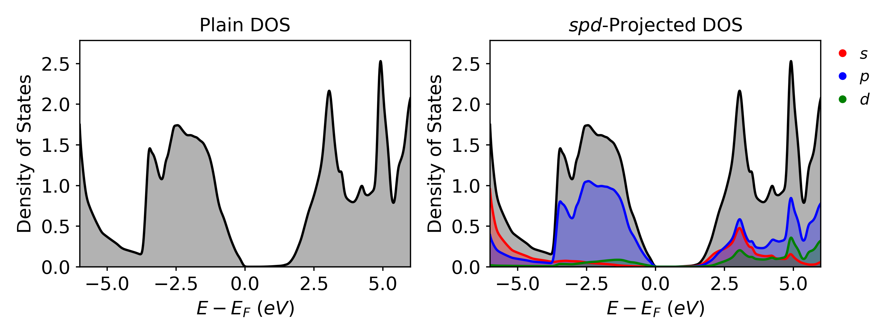
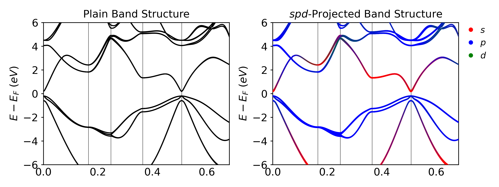

# Bulk InAs (HSE)
In this step we will run our third calculation on bulk InAs where we use a hybrid functional (HSE06) to predict an accurate band gap.

## Recommended Folder Layout
- `basic_training`
	- `InAs_bulk`
		- `hse`
			- `scf`
			- `band`
			- `dos`

## Basic Steps
1. Run the SCF Calculations in the `scf` folder.
2. Copy the WAVECAR file to the `band` and `dos` folders.
	1. HSE is a wavefunction based method so we use the WAVECAR instead of the CHG* files.
3. Run the Band and DOS calculations.
4. Plot the data.

## Global Files
The POSCAR and POTCAR will be the same for the SCF, DOS, and Band calculations.

### POSCAR
The POSCAR for the bulk InAs is given below

```txt
In1 As1  
1.0  
0.000000 3.029200 3.029200  
3.029200 0.000000 3.029200  
3.029200 3.029200 0.000000  
In As  
1 1  
direct  
0.000000 0.000000 0.000000 In  
0.250000 0.250000 0.250000 As
```

### POTCAR
The POTCAR can be easily generated using the potcar.sh script included in the basic training files.

```bash
potcar.sh In As
```

To double check the elements in the POTCAR you can run the following command

```bash
grep 'TITEL' POTCAR
```

The output will be the following

```txt
TITEL = PAW_PBE In 08Apr2002  
TITEL = PAW_PBE As 22Sep2009
```

## Automation
This entire calculation can be automated using a simple python script included below. Two notes on KPOINTS:

- The **band** step's KPOINTS is HSE-flavoured (SCF `IBZKPT` + line k-points with weight 0) and depends on the SCF run, so we generate it in the submission script.
- The **DOS** step uses `ALGO = None`, which only re-reads orbitals and eigenvalues already in `WAVECAR` (no diagonalisation). The DOS k-mesh is therefore fixed by the SCF mesh — densifying past the SCF grid would have no effect — so we just copy SCF's KPOINTS into `dos/`. Pick an SCF mesh dense enough for the DOS up front (here 11×11×11).

```python
from os.path import isdir, join
import os
import shutil

dirs = ["scf", "dos", "band"]
base_dir = os.getcwd()

for d in dirs:
    print(d)

    if not isdir(d):
        os.mkdir(d)

    shutil.copy("POSCAR", join(d, "POSCAR"))

    os.chdir(d)
    os.system(f"incar.py --{d} --hse -c --kpar 16 --ncore 1")
    os.system("potcar.sh In As")

    if d == "scf":
        os.system("kpoints.py -g -d 11 11 11")
    elif d == "dos":
        # ALGO = None reads only what's in WAVECAR — DOS k-mesh = SCF k-mesh
        shutil.copy("../scf/KPOINTS", "KPOINTS")
    # band's KPOINTS is generated in the submission script

    os.chdir(base_dir)
```

And it can be submitted to the cluster using the following script.

```bash
#!/bin/bash
#SBATCH -J hse
#SBATCH -A m3578
#SBATCH -N 4                  # HSE is expensive — scale up
#SBATCH -C cpu
#SBATCH -q regular
#SBATCH -t 03:00:00
#SBATCH -o stdout

module load vasp/6.4.3-cpu

# 16 MPI ranks * 8 OpenMP threads per node => 64 ranks * 8 threads on 4 nodes
export OMP_NUM_THREADS=8
export OMP_PLACES=threads
export OMP_PROC_BIND=spread

cd scf
srun -n 64 -c 16 --cpu_bind=cores vasp_ncl > vasp.out

# Fill in EMIN/EMAX of the DOS INCAR from the SCF Fermi level
fermi_str=$(grep 'E-fermi' OUTCAR)
fermi_array=($fermi_str)
efermi=${fermi_array[2]}
emin=`echo $efermi - 7 | bc -l`
emax=`echo $efermi + 7 | bc -l`
sed -i "s/EMIN = emin/EMIN = $emin/" ../dos/INCAR
sed -i "s/EMAX = emax/EMAX = $emax/" ../dos/INCAR

cp WAVECAR ../band
cp WAVECAR ../dos

cd ../band
kpoints.py -b -c GXWLGK -e --ibzkpt ../scf/IBZKPT -n 40
srun -n 64 -c 16 --cpu_bind=cores vasp_ncl > vasp.out

cd ../dos
srun -n 64 -c 16 --cpu_bind=cores vasp_ncl > vasp.out
```

## SCF Calculation
The first step in any calculation is to perform the SCF calculation. In this section, the process to set up the input files will be shown. For a more detailed breakdown of the SCF calculation see [Calculation Descriptions](../Tutorial_2/).

### INCAR
As shown in section [Calculation Descriptions](../Tutorial_2/) the INCAR for an SCF calculation can be generated using the incar.py file.

```bash
incar.py --scf --soc --hse
or
incar.py -s -c -e
```

This results in the following file.

```txt
# general
ALGO = Fast     # Mixture of Davidson and RMM-DIIS algos
PREC = Normal        # Normal precision
GGA_COMPAT = .False.   # Restore the full lattice symmetry of the GGA potential
EDIFF = 1E-6    # Convergence criteria for electronic converge
NELM = 500      # Max number of electronic steps
ENCUT = 400     # Cut off energy
LASPH = .True.    # Include non-spherical contributions from gradient corrections
BMIX = 3        # Mixing parameter for convergence
AMIN = 0.01     # Mixing parameter for convergence
SIGMA = 0.05    # Width of smearing in eV

# parallelization
KPAR = 8        # The number of k-points to be treated in parallel
NCORE = 1        # Auto-reset to 1 by VASP when OpenMP is enabled

# scf
ICHARG = 2      # Generate CHG* from a superposition of atomic charge densities
ISMEAR = 0      # Fermi smearing
LCHARG = .True.   # Write the CHG* files
LWAVE = .True.   # Write the WAVECAR (HSE post-SCF DOS reads it via ALGO = None)
LREAL = Auto    # Automatically chooses real/reciprocal space for projections

# soc 
LSORBIT = .True.  # Turn on spin-orbit coupling
MAGMOM = 6*0 # Set the magnetic moment for each atom (3 for each atom)

# hse 
LHFCALC = .True.  # Determines if a hybrid functional is used
HFSCREEN = 0.2  # Range-separation parameter
AEXX = 0.25     # Fraction of exact exchange to be used
PRECFOCK = Fast # Increases the speed of HSE Calculations
```

## Density of States Calculation
After the SCF calculation is finished, the WAVECAR file can be copied to the folder with the DOS calculation files. For a more detailed breakdown of the DOS calculation see section [Calculation Descriptions](../Tutorial_2/).

### INCAR
The INCAR for a DOS calculation can be generated using the incar.py file.

```bash
incar.py --dos --soc --hse
or
incar.py -d -c -e
```

Which results in the following file. The values of EMIN and EMAX were automatically  determined using the code shown in section [Calculation Descriptions](../Tutorial_2/).

```txt
# general 
ALGO = Fast     # Mixture of Davidson and RMM-DIIS algos
PREC = Normal        # Normal precision
GGA_COMPAT = .False.   # Restore the full lattice symmetry of the GGA potential
EDIFF = 1E-6    # Convergence criteria for electronic converge
NELM = 500      # Max number of electronic steps
ENCUT = 400     # Cut off energy
LASPH = .True.    # Include non-spherical contributions from gradient corrections
BMIX = 3        # Mixing parameter for convergence
AMIN = 0.01     # Mixing parameter for convergence 
SIGMA = 0.05    # Width of smearing in eV

# parallelization
KPAR = 8        # The number of k-points to be treated in parallel
NCORE = 1        # Auto-reset to 1 by VASP when OpenMP is enabled

# dos (post-process WAVECAR; HSE — no Fock exchange evaluated)
ALGO = None     # Postprocess only: read orbitals + eigenvalues from WAVECAR
NELM = 1        # No iteration (paired with ALGO = None)
ISTART = 1      # Read WAVECAR
ICHARG = 0      # Required for hybrids (never use ICHARG = 11 with HSE)
ISMEAR = -5     # Tetrahedron method with Blochl corrections
LCHARG = .False.  # Does not write the CHG* files
LWAVE = .False.   # Does not write the WAVECAR
LORBIT = 11     # Projected data (lm-decomposed PROCAR)
NEDOS = 3001    # 3001 points are sampled for the DOS
EMIN = -3.7174     # Minimum energy for the DOS plot
EMAX = 10.2826     # Maximum energy for the DOS plot

# soc 
LSORBIT = .True.  # Turn on spin-orbit coupling
MAGMOM = 6*0 # Set the magnetic moment for each atom (3 for each atom)

# (no `# hse` block: ALGO = None doesn't evaluate the Fock operator,
#  so LHFCALC / HFSCREEN / AEXX / PRECFOCK are unnecessary here)
```

### KPOINTS
The DOS step reuses the SCF `KPOINTS` file verbatim. `ALGO = None` only reads the orbitals and eigenvalues already in `WAVECAR`, so the DOS k-mesh is fixed by the SCF mesh — generating a denser one would have no effect. The Python automation above does the copy:

```bash
cp ../scf/KPOINTS .
```

### Results
vaspvis treats HSE the same as PBE — give it the `dos/` folder and let it parse `LHFCALC`:

```python
from vaspvis.standard import dos_plain, dos_spd

dos_plain(folder='dos', output='dos_plain.png')
dos_spd(folder='dos',   output='dos_spd.png',   orbitals='spd')
```



## Band Structure Calculation
After the SCF calculation is finished, the WAVECAR file can be copied to the folder with the Band calculation files. For a more detailed breakdown of the Band calculation see section [Calculation Descriptions](../Tutorial_2/).

### INCAR
The INCAR for a band structure calculation can be generated using the incar.py file.

```bash
incar.py --band --soc --hse
or
incar.py -b -c -e
```

Which results in the following file:

```txt
# general 
ALGO = Fast     # Mixture of Davidson and RMM-DIIS algos
PREC = Normal        # Normal precision
GGA_COMPAT = .False.   # Restore the full lattice symmetry of the GGA potential
EDIFF = 1E-6    # Convergence criteria for electronic converge
NELM = 500      # Max number of electronic steps
ENCUT = 400     # Cut off energy
LASPH = .True.    # Include non-spherical contributions from gradient corrections
BMIX = 3        # Mixing parameter for convergence
AMIN = 0.01     # Mixing parameter for convergence 
SIGMA = 0.05    # Width of smearing in eV

# parallelization
KPAR = 8        # The number of k-points to be treated in parallel
NCORE = 1        # Auto-reset to 1 by VASP when OpenMP is enabled

# band (HSE; restart from WAVECAR with zero-weight line k-points)
ISTART = 1      # Read WAVECAR
ICHARG = 0      # Required for hybrids; charge derived from orbitals
ISMEAR = 0      # Fermi smearing
LCHARG = .False.  # Does not write the CHG* files
LWAVE = .False.   # Does not write the WAVECAR files (.True. for unfolding)
LORBIT = 11     # Projected data (lm-decomposed PROCAR)

# soc 
LSORBIT = .True.  # Turn on spin-orbit coupling
MAGMOM = 6*0 # Set the magnetic moment for each atom (3 for each atom)

# hse 
LHFCALC = .True.  # Determines if a hybrid functional is used
HFSCREEN = 0.2  # Range-separation parameter
AEXX = 0.25     # Fraction of exact exchange to be used
PRECFOCK = Fast # Increases the speed of HSE Calculations
```

### KPOINTS
For a band structure calculation, the KPOINTS file is the most important input because it determines the path of your band structure. Usually we find the path from literature or helpful tools such as <a href="https://www.materialscloud.org/work/tools/seekpath" target="_blank">SeeK-path</a>. For our zinc-blende structures such as InAs we choose the k-path $\Gamma-X-W-L-\Gamma-K$, which can be generated using the following code with `kpoints.py`. The HSE calculation has a special format which is described in [Calculation Descriptions](../Tutorial_2/).

```bash
kpoints.py --band --coords GXWLGK --hse --ibzkpt ../scf/IBZKPT --nsegments 40
or
kpoints.py -b -c GXWLGK -e -i ../scf/IBZKPT -n 40
```

The resulting KPOINTS file will look like this:

```txt
Automatically generated mesh
	230
Reciprocal lattice
    0.00000000000000    0.00000000000000    0.00000000000000             1
    0.14285714285714    0.00000000000000   -0.00000000000000             4
    0.28571428571429    0.00000000000000   -0.00000000000000             4
    0.42857142857143   -0.00000000000000    0.00000000000000             4
   -0.42857142857143    0.00000000000000   -0.00000000000000             4
   ...
   ...
   	0.34615384615385	0.34615384615385	0.69230769230769			 0
	0.35576923076923	0.35576923076923	0.71153846153846			 0
	0.36538461538462	0.36538461538462	0.73076923076923			 0
	0.37500000000000	0.37500000000000	0.75000000000000			 0
```

### Results
For the band structure, vaspvis automatically drops the zero-weight k-points used to seed the HSE band path, so the same call works:

```python
from vaspvis.standard import band_plain, band_spd

band_plain(folder='band', output='band_plain.png')
band_spd(folder='band',   output='band_spd.png')
```



## Concluding Notes
Some things to note about the results:
- HSE is much more expensive than PBE. Plan for tens of minutes per stage on 4 Perlmutter CPU nodes — drop to the GPU build (`vasp/6.4.3-gpu`) on a single GPU node if you need it faster (the exact-exchange operator maps very well onto A100s).
- HSE+SOC properly predicts InAs to have a band gap of 0.39 eV which is very close to the experimental value.
	- HSE06 is a hybrid functional known to give good band gap values for materials, which is why we will use it as our reference in the next step to fit the U-parameter for PBE+U.
